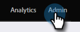

# プログラムメンバーカスタムフィールドの同期 {#program-member-custom-field-sync}

>[!PREREQUISITES]
>
>の作成 [プログラムメンバーカスタムフィールド](/help/marketo/product-docs/core-marketo-concepts/programs/working-with-programs/program-member-custom-fields.md){target=&quot;_blank&quot;}

>[!NOTE]
>
>プログラムメンバーオブジェクトには、最大 20 個のカスタムフィールドを持つことができます。これらのフィールドは、どのプログラムでも使用できます。

## Salesforce フィールドをプログラムメンバーカスタムフィールドにマッピング {#map-salesforce-fields-to-program-member-custom-fields}

1. Marketo で、「**管理者**」をクリックします。

   

1. クリック **Salesforce**&#x200B;を選択し、「 **編集** [ プログラムメンバのカスタムフィールドの同期 ] の横に表示されます。

   

1. 検索ボックスを使用して、マッピングする Salesforce フィールドを見つけます。 この例では、Do Not Call を使用しています。

   

1. ドロップダウンをクリックします。

   

1. マッピングする目的のMarketoプログラムメンバーカスタムフィールドを選択します。

   

   >[!NOTE]
   >
   >このドロップダウンには、Salesforce フィールドのデータ型と一致するプログラムメンバーカスタムフィールドのみが表示されます。

1. その他のフィールドマッピングについては、検索ボックスをオフにして、手順 3 ～ 5 を繰り返します。

1. 終了したら「**保存**」をクリックします。

   

   >[!IMPORTANT]
   >
   >マッピングされたフィールド上のプログラムメンバーデータの変更は、今後、Marketoと Salesforce の間で同期されます。

   >[!NOTE]
   >
   >Salesforce でフィールドのデータ型の名前を変更または変更した場合、そのフィールドとプログラムメンバーカスタムフィールドとのマッピングはすべて削除されます。 ただし、レビュー後に新しいフィールドに再マップすることができます。

## プログラムメンバーカスタムフィールドから Salesforce フィールドのマッピングを解除 {#unmap-salesforce-fields-from-program-member-custom-fields}

フィールドを置き換えるために解放したい場合や、一般的な変更を行う場合は、まずマッピング解除を実行する必要があります。 手順は以下のとおりです。

1. Marketo で、「**管理者**」をクリックします。

   

1. クリック **Salesforce**&#x200B;を選択し、「 **編集** [ プログラムメンバのカスタムフィールドの同期 ] の横に表示されます。

   

1. 検索ボックスを使用して、マッピングを解除するフィールドを見つけます。 この例では、Do Not Call を使用しています。

   

   >[!TIP]
   >
   >次の項目を選択できます。 **マッピング済み** チェックボックスをオンにして、マッピングされたフィールドのみを表示します。

1. マッピングを解除するには、 **X** をクリックします。

   

1. これで、マッピングが削除されます。 「**保存**」をクリックします。

   

## データタイプマッピング {#data-type-mapping}

<table>
  <colgroup>
    <col/>
    <col/>
  </colgroup>
  <tbody>
    <tr>
      <th>SFDC データタイプ</th>
      <th>プログラムメンバーカスタムフィールドデータ型</th>
    </tr>
    <tr>
      <td>テキスト</td>
      <td>文字列</td>
    </tr>
    <tr>
      <td>ピックリスト</td>
      <td>文字列</td>
    </tr>
    <tr>
      <td>複数選択候補リスト</td>
      <td>文字列</td>
    </tr>
    <tr>
      <td>電話</td>
      <td>文字列</td>
    </tr>
    <tr>
      <td>メール</td>
      <td>文字列</td>
    </tr>
    <tr>
      <td>数値 (m)</td>
      <td>整数</td>
    </tr>
    <tr>
      <td>数値 (m,n)</td>
      <td>浮動</td>
    </tr>
    <tr>
      <td>チェックボックス</td>
      <td>ブール値</td>
    </tr>
    <tr>
      <td>URL</td>
      <td>URL</td>
    </tr>
    <tr>
      <td>日付</td>
      <td>日付</td>
    </tr>
    <tr>
      <td>日時</td>
      <td>日時</td>
    </tr>
    <tr>
      <td>参照（参照）</td>
      <td>文字列</td>
    </tr>
    <tr>
      <td>Base64</td>
      <td>文字列</td>
    </tr>
  </tbody>
</table>

>[!MORELIKETHIS]
>
>* [プログラムメンバーデータの変更](/help/marketo/product-docs/core-marketo-concepts/smart-campaigns/program-flow-actions/change-program-member-data.md){target=&quot;_blank&quot;}
>* [プログラムメンバーグリッドのデータを表示](/help/marketo/product-docs/core-marketo-concepts/programs/working-with-programs/manage-and-view-members.md){target=&quot;_blank&quot;}

