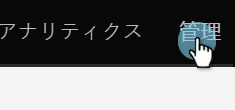
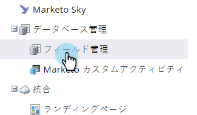
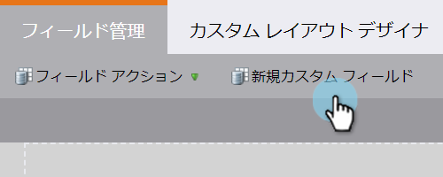
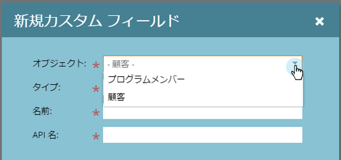
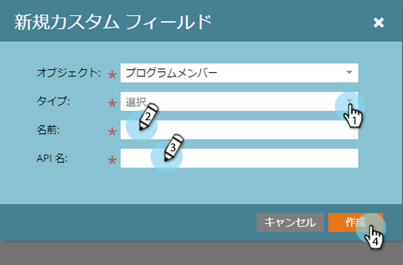
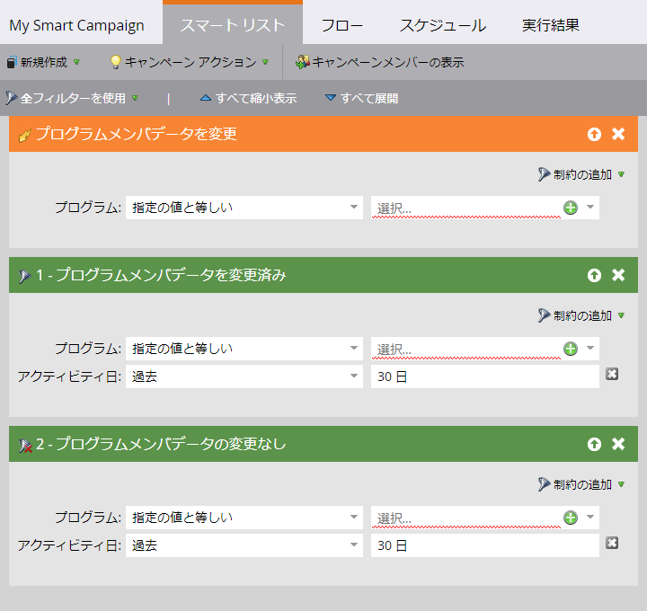

# プログラムメンバのカスタムフィールド {#program-member-custom-fields}

プログラムメンバのカスタムフィールドを使用すると、各メンバのプログラム固有のデータを収集できます。 これらは、次の場所で使用できます。マーケティングフォーム、スマートリストフィルターおよびトリガー、スマートキャンペーンフローアクション。 データは、プログラムの「メンバー」タブで表示できます。

## プログラムメンバのカスタムフィールドの作成 {#create-a-program-member-custom-field}

1. Marketorで、「 **管理者**」をクリックします。

   

1. [ **フィールド管理**]をクリックします。

   

1. 「 **新しいカスタムフィールド**」をクリックします。

   

1. 「オブジェクト」ドロップダウンをクリックし、目的のオブジェクトを選択します。

   

   >[!NOTE]
   >
   >[個人]と[プログラムメンバ]のカスタムフィールドは、同じ名前を共有できません。

1. 残りのフィールドに入力し、「 **作成**」をクリックします。

   

   >[!NOTE]
   >
   >プログラムメンバのカスタムフィールドでサポートされる型は次のとおりです。boolean、date、datetime、float、integer、string、URL。 [フィールドの種類の詳細を表示します](http://docs.marketo.com/x/Wwgt)。

## オブジェクトの説明 {#object-descriptions}

| オブジェクト | 説明 |
|---|---|
| 会社 | 個人に関連付けられている会社の名前。 |
| オポチュニティ | オポチュニティは、将来の潜在的なセールとして個人またはアカウントに関連付けることができます。 通常、CRM経由またはAPI経由でマーケティング担当者に入ります。 |
| 人 | マーケティングキャンペーンを通して関与を果たす、Marketoデータベース内の個人。 |
| プログラムメンバ | プログラムの一員である者 |

## トリガーとフィルター {#triggers-and-filters}

このプログラム固有のデータは、トリガーや フィルターを介してスマートリストで利用でき [ます](http://docs.marketo.com/x/2YAI)。

## 知っておくべきこと {#things-to-know}

* プログラムメンバーのカスタムフィールドは、ローカルアセットでのみ使用できます。 特定のプログラムに関連付ける方法がないので、Design Studioではサポートされません。
* プログラムメンバーカスタムフィールドを含むフォーム(またはフォームを含むランディングページ)をDesign Studioにコピーまたは移動することはできません。
* プログラムメンバのカスタムフィールドは、トークンとして使用できません。
* プログラムメンバオブジェクトには、最大20個のカスタムフィールドを含めることができます。 これらのフィールドは、どのプログラムでも使用できます。
* プログラムのメンバを削除すると、そのユーザの[プログラムメンバ]カスタムフィールドにデータがある場合、そのフィールドからデータがスクラブされます。
* データを表示するには、プログラムの「Members」タブをクリックし、該当するフィールドを含むカスタム表示を作成します。
* リストAPIを使用した読み込みと書き出し がサポ ートされます。
* 2人のユーザーを結合すると、推奨結果のプログラムメンバーのカスタムフィールドデータが使用されます。 ただし、勝者に何もない場合は、敗者の値が使用されます。

>[!NOTE]
>
>**関連記事**
>
>[Marketorでのカスタムフィールドの作成](../../../../product-docs/administration/field-management/create-a-custom-field-in-marketo.md)

