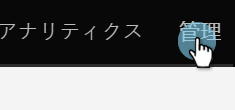
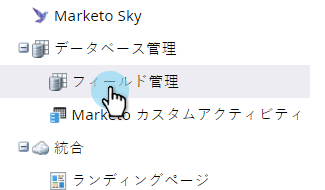
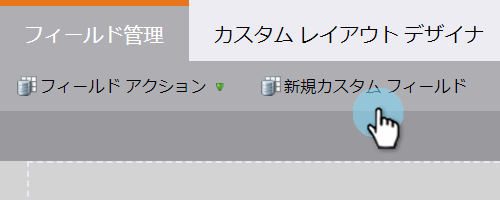
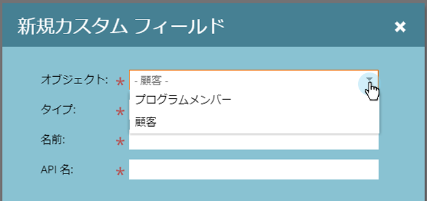
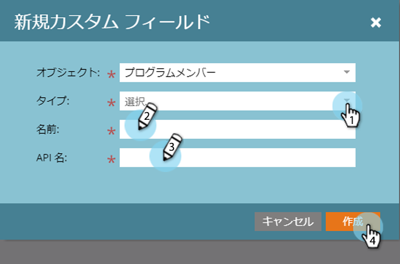
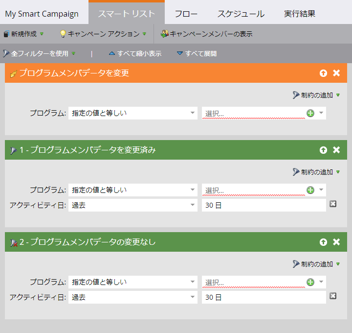

# プログラムメンバーカスタムフィールド {#program-member-custom-fields}

プログラムメンバーカスタムフィールドを使用すると、各メンバーのプログラム固有のデータを収集することができます。 このフィールドは、Marketo フォーム、スマートリストのフィルターとトリガー、スマートキャンペーンのフローアクションで使用できます。 データは、プログラムの「メンバー」タブで確認できます。

## プログラムメンバーカスタムフィールドの作成 {#create-a-program-member-custom-field}

1. Marketo で、「**[!UICONTROL 管理者]**」をクリックします。

   

1. 「**[!UICONTROL フィールド管理]**」をクリックします。

   

1. 「**[!UICONTROL 新規カスタムフィールド]**」をクリックします。

   

1. **[!UICONTROL オブジェクト]**&#x200B;ドロップダウンをクリックし、目的のオブジェクトを選択します。

   

   >[!NOTE]
   >
   >[!UICONTROL 人物]と[!UICONTROL プログラムメンバー]のカスタムフィールドは、同じ名前を共有できません。

1. 残りのフィールドに入力し、「**[!UICONTROL 作成]**」をクリックします。

   

   >[!NOTE]
   >
   >[!UICONTROL プログラムメンバー]カスタムフィールドでサポートされている型は、boolean（ブール値）、date（日）、datetime（日時）、float（浮動小数点数）、integer（整数）、string（文字列）、URL です。 [フィールドタイプの詳細](/help/marketo/product-docs/administration/field-management/custom-field-type-glossary.md){target="_blank"}。

## オブジェクトの詳細 {#object-descriptions}

| オブジェクト | 説明 |
|---|---|
| 企業 | 人物に紐付いている企業名 |
| 商談 | 商談は、潜在的な将来の販売として人物またはアカウントに関連付けることができます。 通常、CRM 経由または API 経由で Marketo に入ります。 |
| 人物 | Marketo データベース内の、マーケティングキャンペーンを通じてエンゲージしている個人。 |
| プログラムメンバー | プログラムに参加している人物 |

## トリガーとフィルター {#triggers-and-filters}

このプログラム固有のデータは、[トリガー](/help/marketo/product-docs/core-marketo-concepts/smart-campaigns/creating-a-smart-campaign/define-smart-list-for-smart-campaign-trigger.md){target="_blank"}や[フィルター](/help/marketo/product-docs/core-marketo-concepts/smart-lists-and-static-lists/creating-a-smart-list/find-and-add-filters-to-a-smart-list.md){target="_blank"}を使ってスマートリストで活用することができます。

## 留意事項 {#things-to-know}

* プログラムメンバーカスタムフィールドは、ローカルアセットでのみ利用可能です。 特定のプログラムに結びつけることができないため、デザインスタジオではサポートされていません。
* プログラムメンバーカスタムフィールドを含むフォーム（またはフォームを持つランディングページ）をデザインスタジオに複製／移動することはできません。
* プログラムメンバーカスタムフィールドは、キャンペーンメンバーカスタムフィールドと[同期可能](/help/marketo/product-docs/core-marketo-concepts/programs/working-with-programs/program-member-custom-field-sync.md){target="_blank"}です。
* プログラムメンバーオブジェクトには、最大 20 個のカスタムフィールドを持つことができます。 これらのフィールドは、どのプログラムでも使用できます。
* プログラムメンバーを削除すると、そのメンバーのカスタムフィールドにデータがある場合、そのフィールドからデータが削除されます。
* データを表示するには、プログラムのメンバータブをクリックして、そのフィールドを含むカスタム表示を作成します。
* [リスト](/help/marketo/getting-started/quick-wins/import-a-list-of-people.md){target="_blank"}と [API](https://experienceleague.adobe.com/ja/docs/marketo-developer/marketo/home){target="_blank"} による読み込みと書き出しが可能です。 エクスポートは、プログラムメンバーリストのみで機能し、静的リストでは機能しません。
* 2 つのリードを結合すると、勝者のプログラムメンバーカスタムフィールドの値が反映されます。 しかし、勝者が値を持っていない場合は、敗者の値が反映されます。
* 「プログラムメンバー情報」フィールドでは、タイプの変更は許可されていません。
* 「次を含む」スマートリスト制約は、プログラムメンバーのカスタムフィールドではサポートされていません。

>[!MORELIKETHIS]
>
>* [Marketo でのカスタムフィールドの作成](/help/marketo/product-docs/administration/field-management/create-a-custom-field-in-marketo.md){target="_blank"}
>
>* [プログラムメンバーカスタムフィールドの同期](/help/marketo/product-docs/core-marketo-concepts/programs/working-with-programs/program-member-custom-field-sync.md){target="_blank"}
