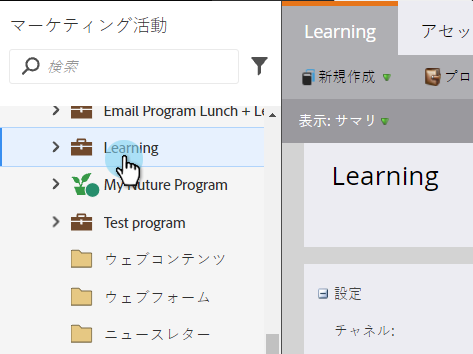
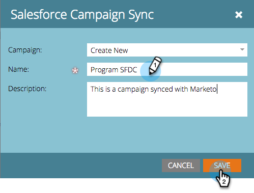

# SFDC キャンペーンとプログラムの同期 {#sync-an-sfdc-campaign-with-a-program}

Marketo を使用すると、プログラムを Salesforce キャンペーンと同期して、両方のシステムの同じリスト（ステータスを含む）を維持できます。それでは始めましょう。

>[!PREREQUISITES]
>
>まず、[Salesforce キャンペーンの同期を有効にする](/help/marketo/product-docs/crm-sync/salesforce-sync/setup/optional-steps/enable-disable-campaign-sync.md)必要があります。

>[!CAUTION]
>
>SFDC キャンペーンを Marketo プログラムと同期する場合、プログラムの子キャンペーンに対して、暗黙の SFDC アクション（例：SFDC キャンペーンへの追加、SFDC への同期）が無効になります。

1. 「**マーケティングアクティビティ**」エリアに移動します。

   

1. プログラムを選択します。

   

1. 「**プログラムアクション**」をクリックし、「**Salesforce キャンペーン同期**」を選択します。

   

1. 「**新規作成**」を選択します。既存の SFDC キャンペーンを選択することもできます。

   >[!TIP]
   >
   >既存の Salesforce キャンペーンを選択する場合は、[Salesforce キャンペーンと Marketo プログラムのプログラムステータスが一致していること](/help/marketo/product-docs/crm-sync/salesforce-sync/sfdc-sync-details/how-to-match-program-statuses-and-salesforce-campaign-statuses-prior-to-sync.md)を確認してください。

1. 新しいキャンペーンの名前を入力し、「**保存**」をクリックします。

   

1. 進行状況が Marketo プログラムのステータスと一致していることを確認します。

   

   これで完了です。Marketo で変更されたプログラムステータスが常に SFDC キャンペーンに同期され、また逆方向にも同期されるようになりました。
