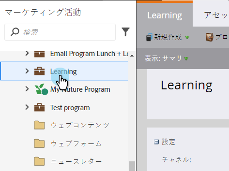
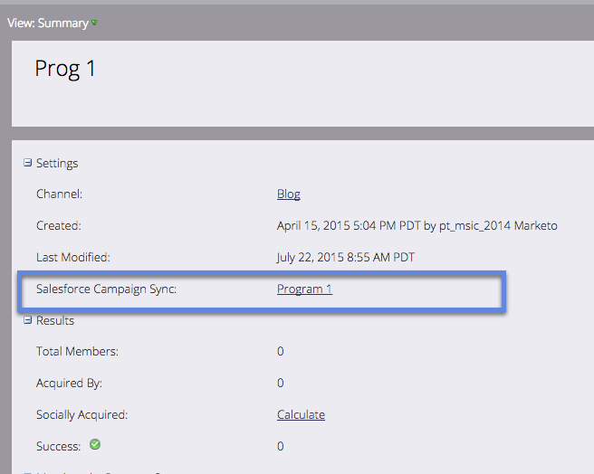

# SFDC キャンペーンとプログラムの同期 {#sync-an-sfdc-campaign-with-a-program}

Marketo Engageを使用すると、プログラムを [!DNL Salesforce] キャンペーンと同期して、両方のシステムで同じ人物のリスト（ステータスを含む）を維持できます。 それでは始めましょう。

>[!PREREQUISITES]
>
>最初に [ 有効にする  [!DNL Salesforce]  キャンペーン同期 ](/help/marketo/product-docs/crm-sync/salesforce-sync/setup/optional-steps/enable-disable-campaign-sync.md){target="_blank"} が必要です。

>[!CAUTION]
>
>SFDC キャンペーンをMarketo Engage プログラムと同期する場合、暗黙のSFDC アクション（SFDC キャンペーンに追加、SFDCに同期など）は、プログラムの子キャンペーンに対して無効になります。

1. **[!UICONTROL マーケティングアクティビティ]**&#x200B;に移動します。

   

1. プログラムを選択します。

   

1. 「**[!UICONTROL プログラムアクション]**」をクリックし、「**[!UICONTROL Salesforce キャンペーン同期]**」を選択します。

   

1. **[!UICONTROL 新規作成]** を選択するか、既存の [!DNL Salesforce] キャンペーンを選択します。

   >[!TIP]
   >
   >既存の [!DNL Salesforce] キャンペーンを選択する場合は、[ キャンペーンのプログラムステータスとMarketo プログラムを一致させる  [!DNL Salesforce]  ことを確認 ](/help/marketo/product-docs/crm-sync/salesforce-sync/sfdc-sync-details/how-to-match-program-statuses-and-salesforce-campaign-statuses-prior-to-sync.md){target="_blank"} ます。

1. 新しいキャンペーンの名前を入力し、「**[!UICONTROL 保存]**」をクリックします。

   

1. 進行状況が Marketo プログラムのステータスと一致していることを確認します。

   

   これで完了です。Marketo で変更されたプログラムステータスが常に SFDC キャンペーンに同期され、また逆方向にも同期されるようになりました。
