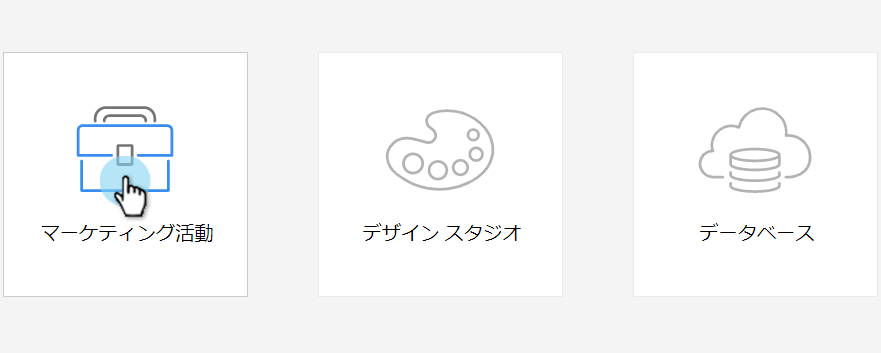

# SFDC キャンペーンとプログラムの同期 {#sync-an-sfdc-campaign-with-a-program}

Marketo Engageを使用すると、プログラムをと同期できます [!DNL Salesforce] キャンペーンを使用して、両方のシステムの同じリストの人（ステータスを含む）を維持できます。 それでは始めましょう。

>[!PREREQUISITES]
>
>まず、[ [!DNL Salesforce]  キャンペーンの同期を有効にする](/help/marketo/product-docs/crm-sync/salesforce-sync/setup/optional-steps/enable-disable-campaign-sync.md){target="_blank"}必要があります。

>[!CAUTION]
>
>SFDC キャンペーンをMarketo Engageプログラムと同期する場合、プログラムの子キャンペーンに対して、暗黙の SFDC アクション（SFDC キャンペーンに追加、SFDC に同期など）が無効になります。

1. 「**[!UICONTROL マーケティング活動]**」に移動します。

   

1. プログラムを選択します。

   

1. 「**[!UICONTROL プログラムアクション]**」をクリックし、「**[!UICONTROL Salesforce キャンペーン同期]**」を選択します。

   

1. 選択 **[!UICONTROL 新規作成]** または既存の [!DNL Salesforce] キャンペーン。

   >[!TIP]
   >
   >既存の [!DNL Salesforce] キャンペーン、必ず [プログラムのステータスに一致する [!DNL Salesforce] キャンペーンとMarketoプログラム](/help/marketo/product-docs/crm-sync/salesforce-sync/sfdc-sync-details/how-to-match-program-statuses-and-salesforce-campaign-statuses-prior-to-sync.md){target="_blank"}.

1. 新しいキャンペーンの名前を入力し、「**[!UICONTROL 保存]**」をクリックします。

   

1. 進行状況が Marketo プログラムのステータスと一致していることを確認します。

   

   これで完了です。Marketo で変更されたプログラムステータスが常に SFDC キャンペーンに同期され、また逆方向にも同期されるようになりました。
