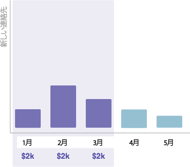

# 期間のコストについて{#understanding-period-costs}

## 概要{#overview}

期間のコストとは、あるプログラムに対して特定の月に費やした費用のことです。

>[!NOTE]
>
>**例**
>
>7月に開始するeBookのイラストレータを1,000ドルで雇用すると、eBookプログラムの期間コストは7月に1,000ドルになります。
>
>Google Adwordsで1か月に$200を費やすと、Google Adwordsプログラムの期間コストは$200 **毎月**&#x200B;となります。

>[!NOTE]
>
>**ディープダイブ**
>
>[プログラムについて](../../../../product-docs/core-marketo-concepts/programs/creating-programs/understanding-programs.md)
>
>[プログラムメンバーシップについて](../../../../product-docs/core-marketo-concepts/programs/creating-programs/understanding-program-membership.md)

## 期間のコストの計算方法{#how-period-costs-are-calculated}

例えば3月にウェビナーが起きるイベントを想像してみて下さい 1月と2月の広告では、あらかじめ新しい人材が獲得される。 4月と5月にウェビナーをダウンロードした場合、イベント後に新しい連絡先も取得されます。

1. 3月に起因する単一期間のコストで…

   

   ...前後の月に追加された連絡先は、3月に対して&#x200B;*のみ*&#x200B;カウントされます。

   

1. 1月、2月、3月に分類される期間コストを含む場合…

   

   ...3月以降の数か月に追加された連絡先は、3月に対してカウントされます。

   

1. 1月と4月の期間原価が原因で…

   

   ...1月から3月に追加された取引先は、1月にカウントされます。 4月と5月に追加された取引先は、4月にカウントされる。

   

   >[!NOTE]
   >
   >**Reminder**
   >
   >
   >要約すると、期間コストが定義されていない月は、最後に定義された月に「後ろ向き」に移動します。 前期間の原価がない場合、月は、定義済の次の月に「転送」されます。 期間のコストが&#x200B;*いずれか*&#x200B;か月に対して定義されていない場合、RCEのレポートはプログラムに対して使用できません。

   >[!NOTE]
   >
   >**関連記事**
   >
   >    
   >    
   >    * [プログラムでの期間原価の使用](using-period-costs-in-a-program.md)
   >    * [期間コストによるプログラムレポートのフィルタリング](../../../../product-docs/core-marketo-concepts/programs/program-performance-report/filter-a-program-report-by-period-cost.md)

