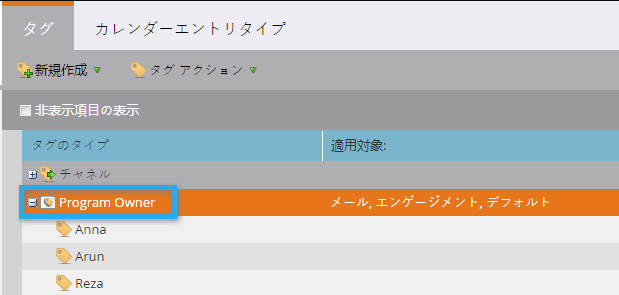
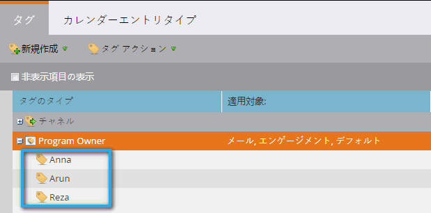
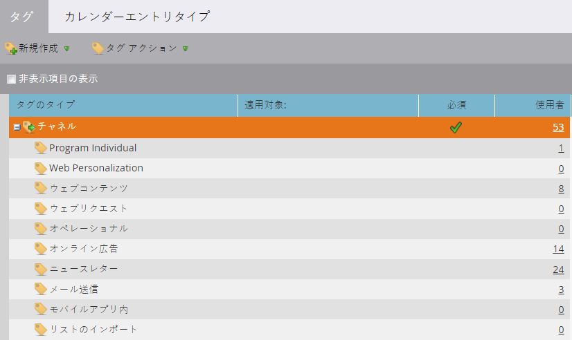

# タグについて{#understanding-tags}

プログラムはマーケトの構成要素のようなものだと今ではお分かりでしょう タグやチャネルを使用すると、レポート目的でデータをフィルタリングできます。

タグは、プログラムを記述するために使用されます。 必要な数だけ作成でき、それぞれに一意の値を設定できます。 チャネルは、ウェビナー、スポンサー、オンライン広告など、プログラム内の配信メカニズムを識別します。

## タグの種類{#tag-type}

タグタイプは、並べ替えの基準となる情報の種類を示します。

>[!TIP]
>
>カスタムタグを作成する場合は、[マーケティング担当者](http://docs.marketo.com/display/DOCS/Create+Custom+Tags)にお問い合わせください。

>[!NOTE]
>
>**例**
>
>* タグの種類=プログラムの所有者

>

## タグ値{#tag-value}

各タグタイプは、値を持ち、値の中から選択します。

>[!NOTE]
>
>**例**
>
>* タグの値= Anna、Arun、Reza

>

## チャネル{#channel}

チャネルは、[メンバー](../../../../product-docs/core-marketo-concepts/programs/creating-programs/understanding-program-membership.md)がプログラム内をどのように移動したかを報告するのに使用します。 各チャネルには、一連の進行ステータスと、同じ成功に設定された1つのステータスがあります。

>[!NOTE]
>
>**例**
>
>* チャネル=ロードショー
   >
   >
* 進行状況=招待、登録済み、出席済み、表示なし
>* 成功=出席

>

>[!MORELIKETHIS]
>
>* [カスタムタグの作成](../../../../product-docs/administration/tags/create-custom-tags.md)
>* [プログラムチャネルの作成](../../../../product-docs/administration/tags/create-a-program-channel.md)

>

