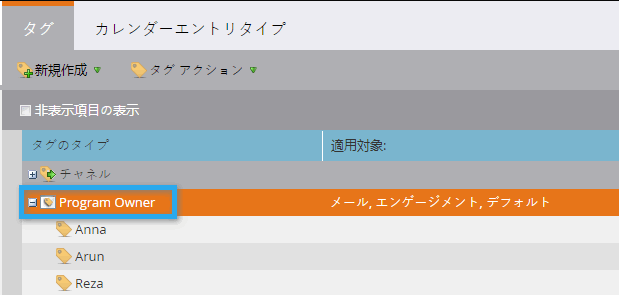
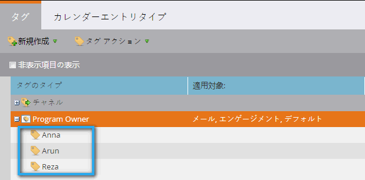
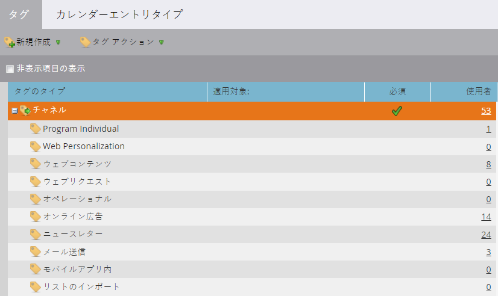

# タグについて {#understanding-tags}

プログラムが Marketo Engage に欠かせない構成要素であることは、既におわかりいただけたことでしょう。 タグとチャネルを利用することで、レポート用にデータを絞り込んで収集することができます。

タグは、プログラムの説明に用いられます。 タグは、必要なだけ、固有の値を設定して作成できます。 チャネルは、ウェビナー、スポンサー広告、オンライン広告など、プログラムの配信メカニズムを識別するためのものです。

## タグのタイプ {#tag-type}

必要に応じて好きなだけ作成して使用できます。

>[!TIP]
>
>[カスタムタグ](/help/marketo/product-docs/administration/tags/create-custom-tags.md){target="_blank"}を作成する場合は、Marketo 管理者にお問い合わせください。

>[!NOTE]
>
>**例**
>
>* [!UICONTROL タグタイプ] = プログラム所有者

## タグ値 {#tag-value}

各タグタイプには、選択可能なタグ値があります。

>[!NOTE]
>
>**例**
>
>* タグ値＝Anna、Arun、Reza

## チャネル {#channel}

チャネルは、プログラムにおける[メンバー](/help/marketo/product-docs/core-marketo-concepts/programs/creating-programs/understanding-program-membership.md){target="_blank"}の進行状況をレポートする際に用いられます。 各チャネルには、一連の進行状況ステータスと、「成功」に設定された 1 つのステータスがあります。

>[!NOTE]
>
>**例**
>
>* チャネル＝説明会
>* 進行状況ステータス＝招待済み、登録済み、出席、無断欠席
>* 成功＝出席

>[!MORELIKETHIS]
>
>* [カスタムタグの作成](/help/marketo/product-docs/administration/tags/create-custom-tags.md){target="_blank"}
>* [プログラムチャネルの作成](/help/marketo/product-docs/administration/tags/create-a-program-channel.md){target="_blank"}
