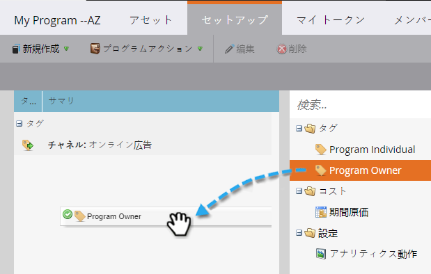
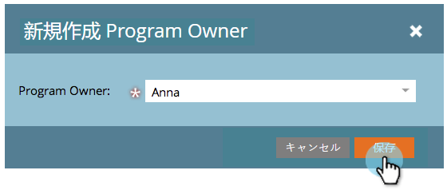
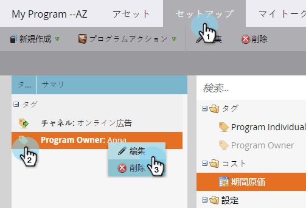

# プログラムでのタグの使用 {#use-tags-in-a-program}

タグは、プログラムを記述する属性で、レポートでプログラムタイプをグループ化するために使用されます。

## プログラムでのタグの使用 {#use-a-tag-in-a-program}

1. プログラムを選択します。「**設定**」をクリックします。

   

1. タグをキャンバスにドラッグ＆ドロップします。

   

1. ドロップダウンから値を選択します。

   

1. 「**保存**」をクリックします。

   

1. 完成です。キャンバスに新しいタグが表示されます。

   

## タグの編集 {#edit-a-tag}

1. 「**設定**」タブに移動します。タグを右クリックします。「**編集**」を選択します。

   

1. ドロップダウンをクリックします。新しい値を選択します。

   

1. 「**保存**」をクリックします。

   

1. 完成です。編集内容がキャンバスに反映されているのがわかります。

   

## タグの削除  {#delete-a-tag}

1. 「**設定**」タブに移動します。タグを右クリックし、「**削除**」を選択します。

   

1. 「**削除**」をクリックして確定します。

   

完成です。タグが消去されています。プログラムで一貫したタグを使用すると、レポートを実行する際に作業が容易になります。
