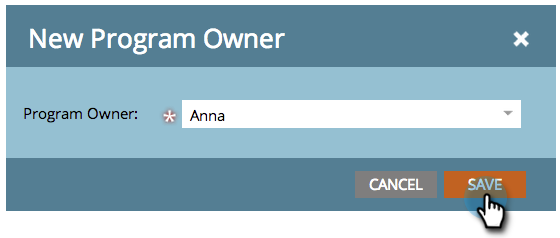
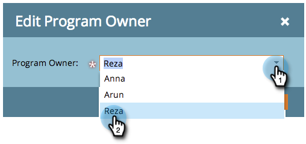
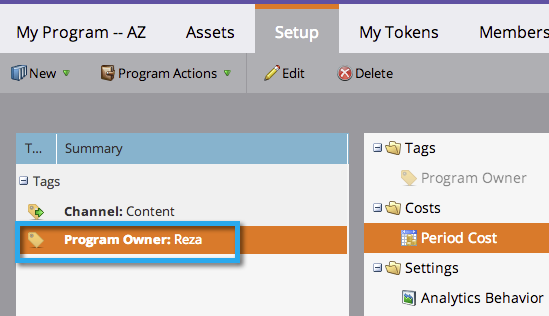

# プログラムでのタグの使用 {#use-tags-in-a-program}

タグは、プログラムを記述する属性で、レポートでプログラムタイプをグループ化するために使用されます。

>[!NOTE]
>
>収益サイクル エクスプローラーを使用する場合、レポートをプログラムで使用できるようにするには、期間原価を（0の場合でも）定義する必要があります。

## プログラムでのタグの使用 {#use-a-tag-in-a-program}

1. プログラムを選択します。 「**[!UICONTROL 設定]**」をクリックします。

   

1. タグをキャンバスにドラッグ＆ドロップします。

   

1. ドロップダウンから値を選択します。

   

1. 「**[!UICONTROL 保存]**」をクリックします。

   

1. 新しいタグがキャンバスに表示されます。

   

## タグの編集 {#edit-a-tag}

1. 「**[!UICONTROL 設定]**」タブに移動します。 タグを右クリックします。 「**[!UICONTROL 編集]**」を選択します。

   

1. ドロップダウンをクリックします。 新しい値を選択します。

   

1. 「**[!UICONTROL 保存]**」をクリックします。

   

1. これで、編集内容がキャンバスに反映されます。

   

## タグの削除  {#delete-a-tag}

1. 「**[!UICONTROL 設定]**」タブに移動します。 タグを右クリックし、「**[!UICONTROL 削除]**」を選択します。

   

1. 「**[!UICONTROL 削除]**」をクリックして確定します。

   

一貫性のあるタグを使用したプログラムにより、レポート作成がより効率的になります。
