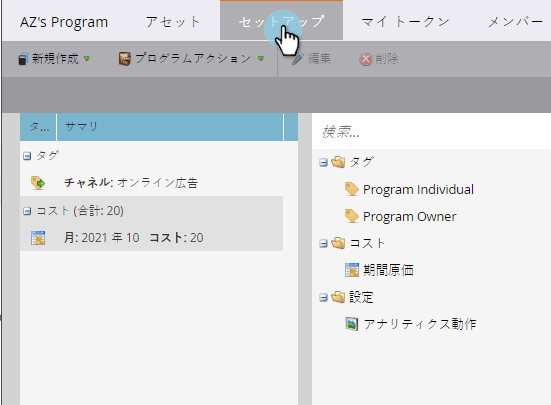
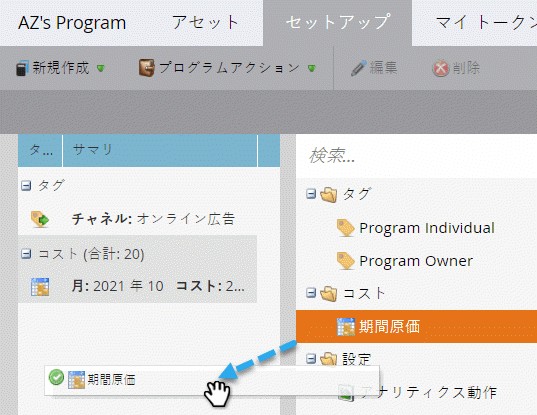
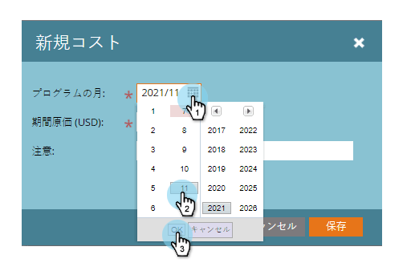
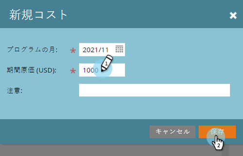
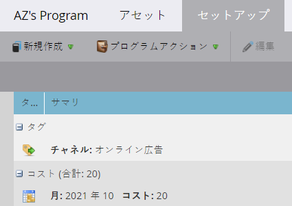
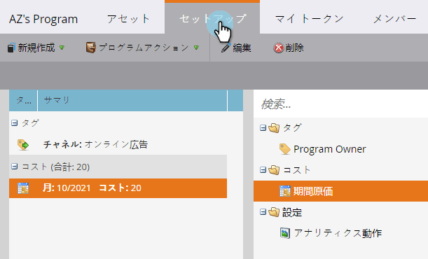
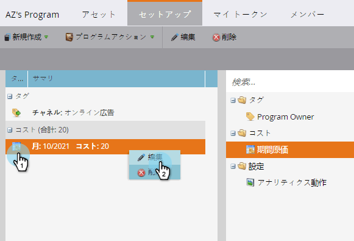
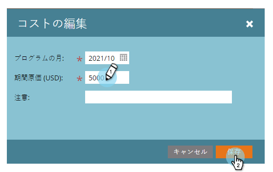
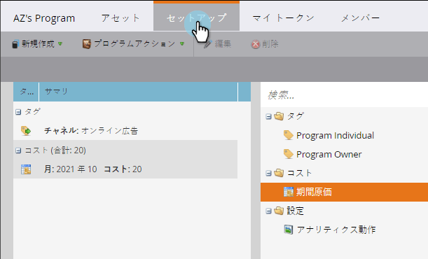
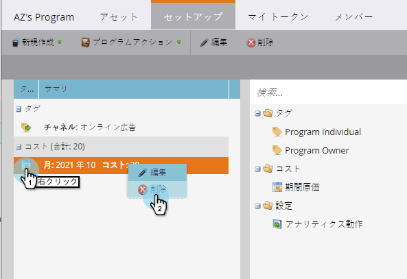

# プログラムでの期間コストの使用{#using-period-costs-in-a-program}

[期間コスト](understanding-period-costs.md)は、プログラムに費やした金額です。 1か月以上の期間に対応し、レポートのROIに使用されます。

>[!NOTE]
>
>**ディープダイブ**
>
> [売上サイクル分析](http://docs.marketo.com/display/docs/revenue+cycle+analytics)の詳細を表示します。

## 期追加間コスト{#add-a-period-cost}

1. プログラムの&#x200B;**「セットアップ**」タブに移動します。

   

1. キャンバスに&#x200B;**期間コスト**&#x200B;をドラッグ&amp;ドロップします。

   

1. カレンダーアイコンをクリックします。 月を選択します。 「**OK**」をクリックします。

   

1. **期間コスト**&#x200B;を入力します（小数やコンマは使用できません）。 「**保存**」をクリックします。

   >[!NOTE]
   >
   >これは見積もりにすることができます。 正確な金額がわかれば、いつでも期間のコストを編集できます（次の節を参照）。

   

1. コストがプログラムに表示されます。

   

   >[!TIP]
   >
   >複数の期間のコストをキャンバスにドラッグ&amp;ドロップできます。 これにより、プログラムに対して異なる期間コストを持つ複数の月をアトリビュートできます。

## 期間のコストの編集{#edit-a-period-cost}

1. 当初予測より多くの金額または少ない金額を使用する場合は、期間原価を編集できます。
1. プログラムの「**Setup **」タブに移動します。

   

1. **期間コスト**&#x200B;を右クリックします。 「**編集**」を選択します。

   

1. 編集を行います。 「**保存**」をクリックします。

   

## 期間コストの削除{#delete-a-period-cost}

1. プログラムの&#x200B;**「セットアップ**」タブに移動します。

   

1. **期間コスト**&#x200B;を右クリックします。 「**削除**」を選択します。

   

1. 「**削除**」をクリックして確定します。

   

>[!MORELIKETHIS]
>
>* [期間原価の理解](understanding-period-costs.md)
>* [売上高サイクル分析](http://docs.marketo.com/display/docs/revenue+cycle+analytics)
>* [期間コストによるプログラムレポートのフィルタリング](../../../../product-docs/core-marketo-concepts/programs/program-performance-report/filter-a-program-report-by-period-cost.md)

>

