# プログラムでの期間原価の使用 {#using-period-costs-in-a-program}

[期間原価](/help/marketo/product-docs/core-marketo-concepts/programs/working-with-programs/understanding-period-costs.md){target="_blank"}は、プログラムに費やした金額です。 1 か月以上かかる場合もあり、ROI のレポートに使用されます。

## 期間原価を追加する  {#add-a-period-cost}

1. プログラムの「**[!UICONTROL 設定]**」タブに移動します

   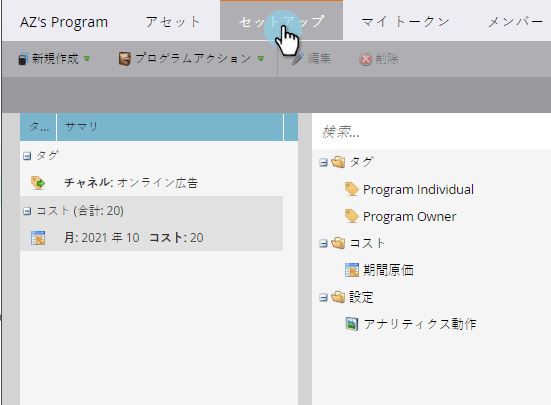

1. 「**[!UICONTROL 期間原価]**」をキャンバスにドラッグ＆ドロップします。

   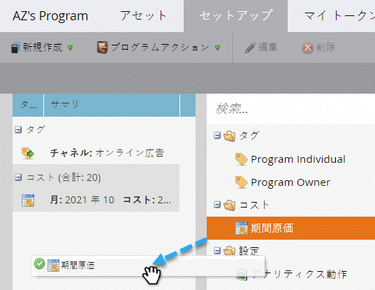

1. カレンダーアイコンをクリックします。 月を選択します。 「**[!UICONTROL OK]**」をクリックします。

   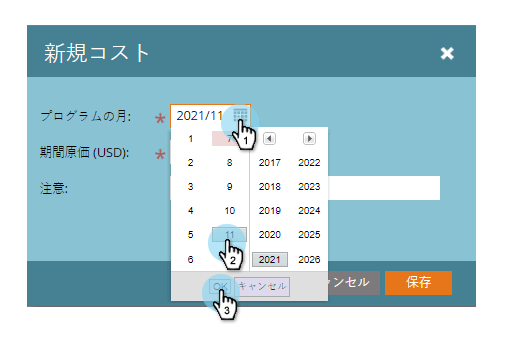

1. **[!UICONTROL 期間原価]**&#x200B;を入力します（小数点やコンマを除く）。 「**[!UICONTROL 保存]**」をクリックします。

   >[!NOTE]
   >
   >これは推定値でも構いません。 正確な金額がわかれば、いつでも期間原価を編集できます（次の節を参照）。

   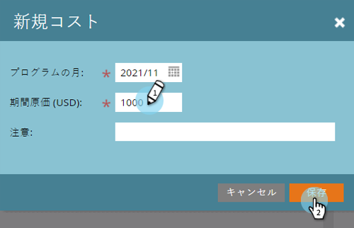

1. 原価がプログラムに表示されます。

   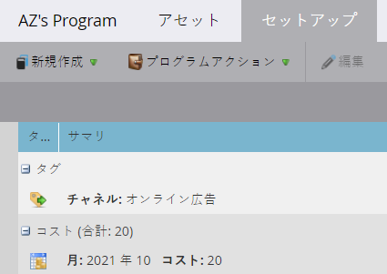

   >[!TIP]
   >
   >複数の期間原価をキャンバスにドラッグ＆ドロップできます。 これにより、複数の月を異なる期間原価でプログラムに関連付けることができます。

## 期間原価を編集する {#edit-a-period-cost}

1. 当初の予測よりも費用が多くかかったり少なく済んだりした場合は、期間原価を編集できます。

1. プログラムの「**[!UICONTROL 設定]**」タブに移動します

   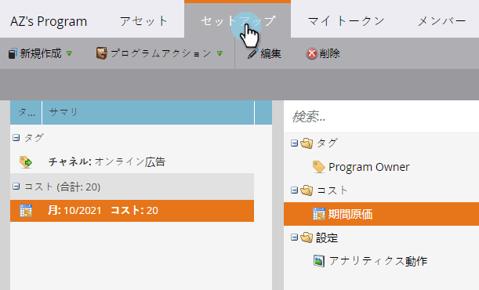

1. 「**[!UICONTROL 期間原価]**」を右クリックします。 「**[!UICONTROL 編集]**」を選択します。

   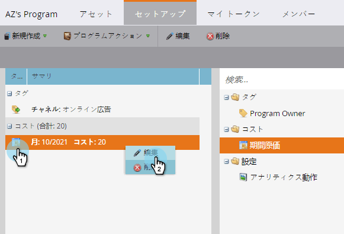

1. 編集をおこないます。 「**[!UICONTROL 保存]**」をクリックします。

   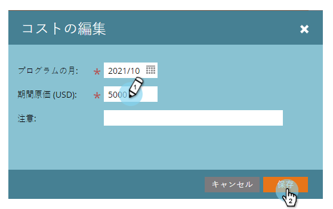

## 期間原価を削除する {#delete-a-period-cost}

1. プログラムの「**[!UICONTROL 設定]**」タブに移動します

   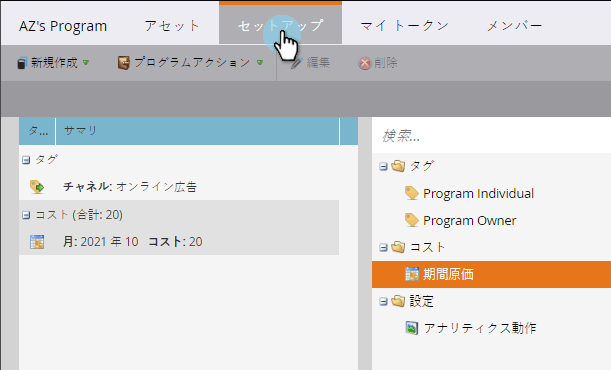

1. 「**[!UICONTROL 期間原価]**」を右クリックします。 「**[!UICONTROL 削除]**」を選択します。

   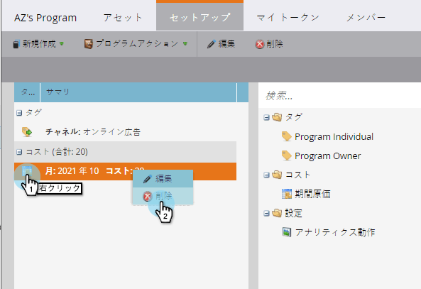

1. 「**[!UICONTROL 削除]**」をクリックして確定します。

   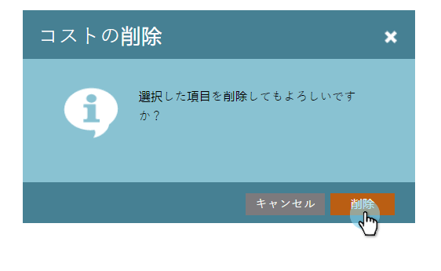

>[!MORELIKETHIS]
>
>* [期間原価について](/help/marketo/product-docs/core-marketo-concepts/programs/working-with-programs/understanding-period-costs.md){target="_blank"}
>* [プログラムレポートを期間原価でフィルター](/help/marketo/product-docs/core-marketo-concepts/programs/program-performance-report/filter-a-program-report-by-period-cost.md){target="_blank"}
