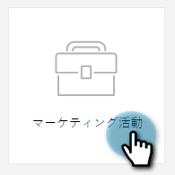
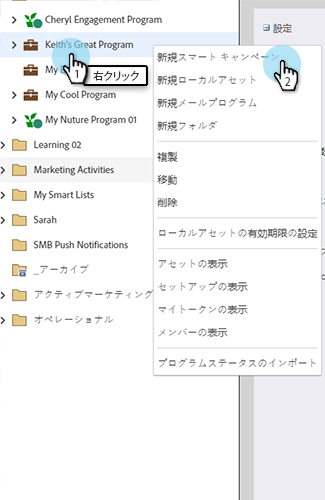
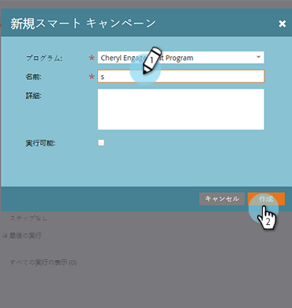

# 新規スマートキャンペーンの作成 {#create-a-new-smart-campaign}

スマートキャンペーンは、Marketo Engageで最も重要なツールです。 1 人の人物に対してトリガーを設定してアクションを実行したり、まとめて数百万人に一連のフローステップを実行したりできます。

>[!TIP]
>
>詳細情報： [スマートキャンペーン](/help/marketo/product-docs/core-marketo-concepts/smart-campaigns/understanding-smart-campaigns.md){target="_blank"}.

1. 「**マーケティングアクティビティ**」に移動します。

   

1. 目的のプログラムを右クリックし、「 」を選択します。 **新規スマートキャンペーン**.

   

   >[!TIP]
   >
   >スマートキャンペーンは、任意のプログラムのローカルアセットとして作成できます。

1. スマートキャンペーン名を入力し、 **作成**.

   

   次に、スマートリストを使用してスマートキャンペーンを実行する担当者を定義する方法を説明します。

   >[!MORELIKETHIS]
   >
   >* [スマートキャンペーン用スマートリストの定義 | バッチ](/help/marketo/product-docs/core-marketo-concepts/smart-campaigns/creating-a-smart-campaign/define-smart-list-for-smart-campaign-batch.md){target="_blank"}
   >* [スマートキャンペーン用スマートリストの定義 |トリガー](/help/marketo/product-docs/core-marketo-concepts/smart-campaigns/creating-a-smart-campaign/define-smart-list-for-smart-campaign-trigger.md){target="_blank"}

