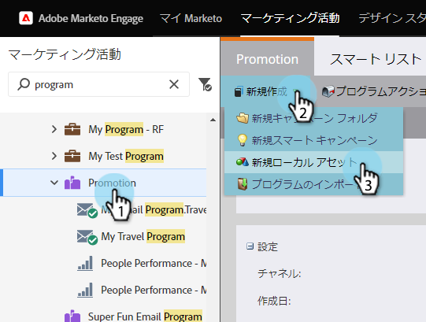
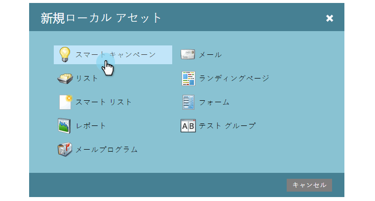
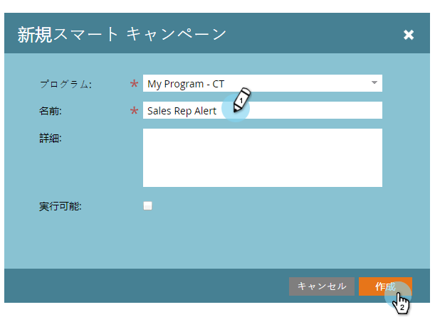

# 新しいスマートキャンペーンの作成{#create-a-new-smart-campaign}

スマートキャンペーンは、Marketoで最も重要なツールです。 ユーザーは1人のユーザーに対してトリガーし、アクションを実行できます。また、数百万人のユーザーをロールアップし、一連のフローステップを実行できます。

>[!NOTE]
>
>**ディープダイブ**
>
>スマートキャンペーンはとても格好良い。 詳しくは、[ここ](../../../../product-docs/core-marketo-concepts/smart-campaigns/understanding-smart-campaigns.md)を参照してください。

1. **マーケティングアクティビティ**&#x200B;に移動します。

   

1. **プログラム**&#x200B;を選択し、**新しい**&#x200B;の下の「**新しいローカルアセット**」をクリックします。

   

   >[!TIP]
   >
   >スマートキャンペーンは、任意のプログラムのローカルアセットとして作成できます。

1. **スマートキャンペーン**&#x200B;をクリックします。

   

1. スマートキャンペーン名を入力し、「**作成**」をクリックします。

   

   クール！ 次に、スマートリストを使用して、スマートキャンペーンを実行するユーザーを定義する方法を説明します。

   >[!NOTE]
   >
   >**関連記事**
   >
   >    
   >    
   >    * [スマートキャンペーンのスマートリストの定義 |バッチ](define-smart-list-for-smart-campaign-batch.md)
   >    * [スマートキャンペーンのスマートリストの定義 |トリガー](define-smart-list-for-smart-campaign-trigger.md)

