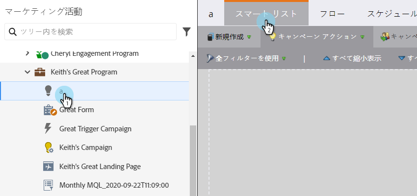
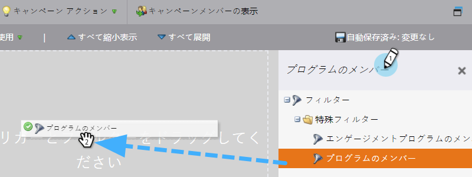
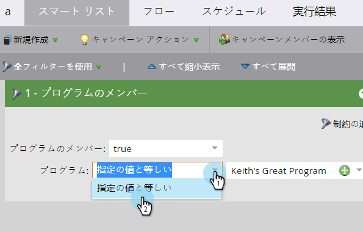
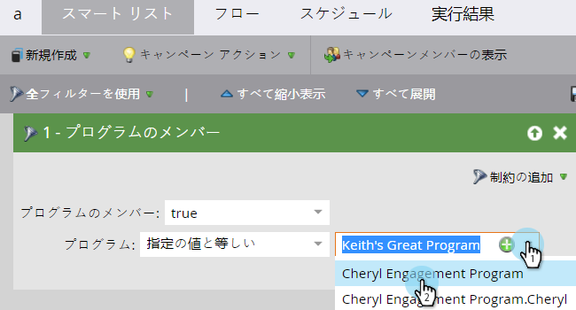

# スマートキャンペーン用スマートリストの定義 | バッチ {#define-smart-list-for-smart-campaign-batch}

スマートリストは、Marketo全体で、レポート、リスト、スマートキャンペーンのどれであるかに関わらず、「誰」（どのユーザー）を含めるかを定義するメカニズムです。 バッチキャンペーンのスマートリストを定義する方法を次に示します。

1. スマートキャンペーンを選択し、 **スマートリスト**.

   

1. 「 」と入力してフィルターを検索し、キャンバスにドラッグ&amp;ドロップします。 複数のフィルターに対して繰り返します。

   

   >[!NOTE]
   >
   >フィルターのみのスマートキャンペーンは、 **バッチ** モード。 フィルターに基づいて適合するデータベース内の人物を検索し、それらすべての人に対して一度にフローを実行します。

   >[!NOTE]
   >
   >スマートキャンペーンをライブイベントに基づいて一度に 1 人のユーザーに対して実行させる場合は、トリガーを追加します。追加すると、スマートキャンペーンが **トリガー** モード。

1. ドロップダウンをクリックし、選択したフィルターのフィルター演算子を選択します。

   

   >[!CAUTION]
   >
   >赤い波線は、エラーまたは情報が見つからないことを示します。修正されない場合、キャンペーンは無効になり、実行されません。

1. フィルター値を入力します。

   

   >[!NOTE]
   >
   >デフォルトでは、すべてのスマートリストルールを満たす担当者が選定されます。 これは、キャンペーンのニーズに合わせて変更できます。[複雑なロジックのスマートリストルール](/help/marketo/product-docs/core-marketo-concepts/smart-lists-and-static-lists/using-smart-lists/using-advanced-smart-list-rule-logic.md)を参照してください。

   ライブトリガーで 1 人ずつイベントを作成するには、[スマートキャンペーン用スマートリストの定義 | トリガー](/help/marketo/product-docs/core-marketo-concepts/smart-campaigns/creating-a-smart-campaign/define-smart-list-for-smart-campaign-trigger.md)を参照してください。

   >[!MORELIKETHIS]
   >
   >* [スマートキャンペーン用スマートリストの定義 |トリガー](/help/marketo/product-docs/core-marketo-concepts/smart-campaigns/creating-a-smart-campaign/define-smart-list-for-smart-campaign-trigger.md)
   >* [スマートキャンペーンへのフローステップの追加](/help/marketo/product-docs/core-marketo-concepts/smart-campaigns/flow-actions/add-a-flow-step-to-a-smart-campaign.md)

