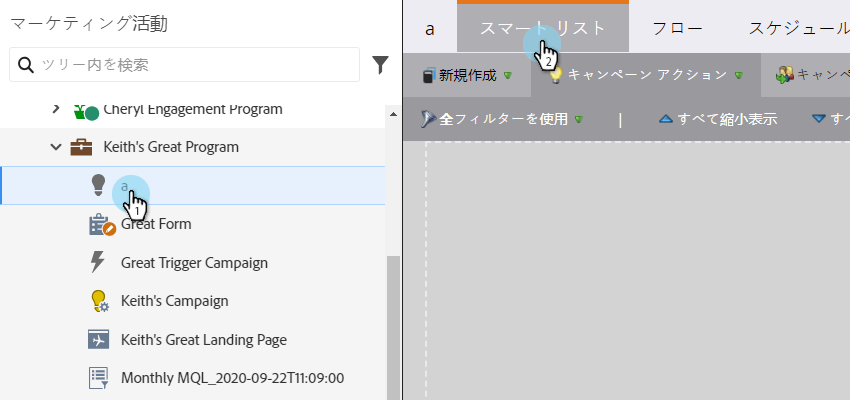
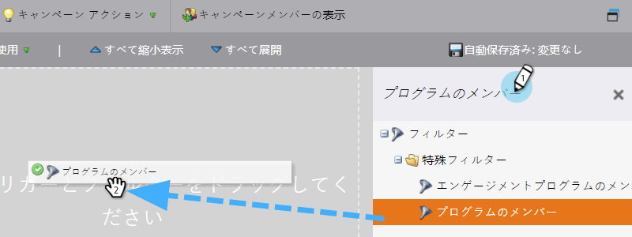
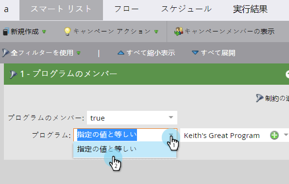
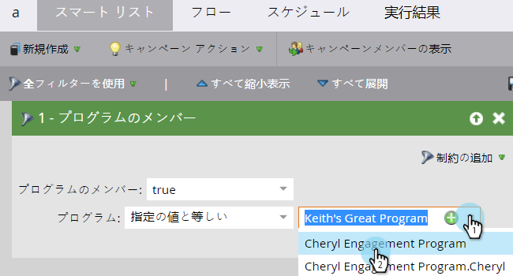

# スマートキャンペーン用スマートリストの定義 | バッチ {#define-smart-list-for-smart-campaign-batch}

スマートリストは、レポート、リスト、スマートキャンペーンなど、Marketo Engage全体で含める「誰」を定義する仕組みです。

>[!CAUTION]
>
>アクティブなキャンペーンに対してスマートリストまたはフローステップの編集を行うと、その機能が損なわれる可能性があります。 その場合は、慎重に作業を進めてください。

1. スマートキャンペーンを選択し、「**[!UICONTROL スマートリスト]**」をクリックします。

   

1. 入力してフィルターを検索し、キャンバスにドラッグ＆ドロップします。 同じ操作を複数のフィルターに対して繰り返します。

   

   >[!NOTE]
   >
   >フィルターのみのスマートキャンペーンは、_バッチ_&#x200B;モードで実行されます。 適合するデータベース内の人物をフィルターに基づいて検索し、それらすべての人物に対して一度にフローを実行します。

   >[!NOTE]
   >
   >ライブイベントに基づいて 1 人ずつスマートキャンペーンを実行できるようにするには、トリガーを追加します。スマートキャンペーンは&#x200B;_トリガー_&#x200B;モードになります。

1. ドロップダウンをクリックし、選択したフィルターのフィルター演算子を選択します。

   

   >[!CAUTION]
   >
   >赤い波線は、エラーまたは情報が見つからないことを示します。 修正されない場合、キャンペーンは無効になり、実行されません。

1. フィルター値を入力します。

   

   >[!NOTE]
   >
   >デフォルトでは、すべてのスマートリストルールを満たす人物が選定されます。 これは、キャンペーンのニーズに合わせて変更できます。 [複雑なロジックのスマートリストルール](/help/marketo/product-docs/core-marketo-concepts/smart-lists-and-static-lists/using-smart-lists/using-advanced-smart-list-rule-logic.md){target="_blank"}を参照してください。

   ライブトリガーで 1 人ずつイベントを作成するには、[スマートキャンペーン用スマートリストの定義 | トリガー](/help/marketo/product-docs/core-marketo-concepts/smart-campaigns/creating-a-smart-campaign/define-smart-list-for-smart-campaign-trigger.md){target="_blank"}を参照してください。

   >[!MORELIKETHIS]
   >
   >* [スマートキャンペーン用スマートリストの定義 |トリガー](/help/marketo/product-docs/core-marketo-concepts/smart-campaigns/creating-a-smart-campaign/define-smart-list-for-smart-campaign-trigger.md){target="_blank"}
   >* [スマートキャンペーンへのフローステップの追加](/help/marketo/product-docs/core-marketo-concepts/smart-campaigns/flow-actions/add-a-flow-step-to-a-smart-campaign.md){target="_blank"}
