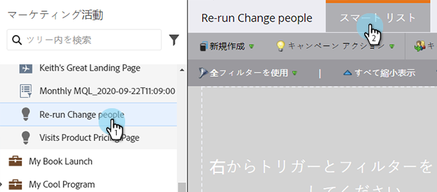
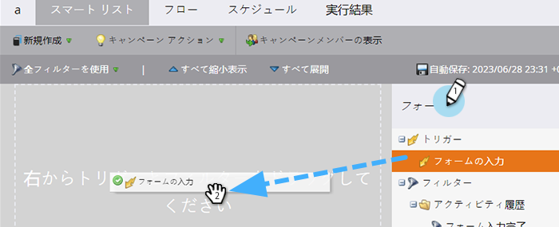
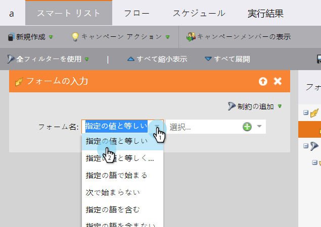
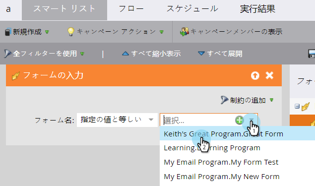

# スマートキャンペーン用スマートリストの定義 |トリガー {#define-smart-list-for-smart-campaign-trigger}

トリガーを追加して、ライブイベントに基づいて、一度に 1 人のユーザーでスマートキャンペーンを実行できます。

1. スマートキャンペーンで、 **スマートリスト** タブをクリックします。

   

1. 目的のトリガーを検索し、キャンバスにドラッグ&amp;ドロップします。

   

   >[!NOTE]
   >
   >スマートキャンペーンとトリガー実行 **トリガー** モード。 トリガーされたイベントと追加された任意のフィルターに基づいて、1 人につき一度ずつ実行されます。

   >[!IMPORTANT]
   >
   >トリガーキャンペーンスマートリストで、ブーリアンフィールドを使用する場合、キャンペーンの実行中にフィールドが正しく評価されるように、明示的に「false」に設定する必要があります。

1. ドロップダウンをクリックし、演算子を選択します。

   

   >[!CAUTION]
   >
   >赤い波線は、エラーまたは情報が見つからないことを示します。修正されない場合、キャンペーンは無効になり、実行されません。

   >[!TIP]
   >
   >トリガーとフィルターの両方を持つスマートキャンペーンでは、トリガーが一番上に表示され、トリガーされると、フィルター条件を満たす人のみがフローを通過します。

1. トリガーを定義します。

   

   >[!NOTE]
   >
   >複数のトリガーを使用する場合、**いずれかの**&#x200B;トリガーがアクティブ化すると、フローに進みます。

一連のリードに対してキャンペーンを同時に実行するには、[スマートキャンペーンのスマートリストを定義する | バッチ](/help/marketo/product-docs/core-marketo-concepts/smart-campaigns/creating-a-smart-campaign/define-smart-list-for-smart-campaign-batch.md)を参照してください。

>[!MORELIKETHIS]
>
>[スマートキャンペーンへのフローステップの追加](/help/marketo/product-docs/core-marketo-concepts/smart-campaigns/flow-actions/add-a-flow-step-to-a-smart-campaign.md)
