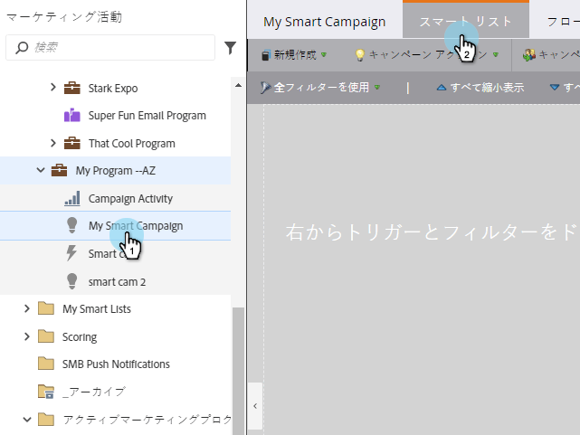
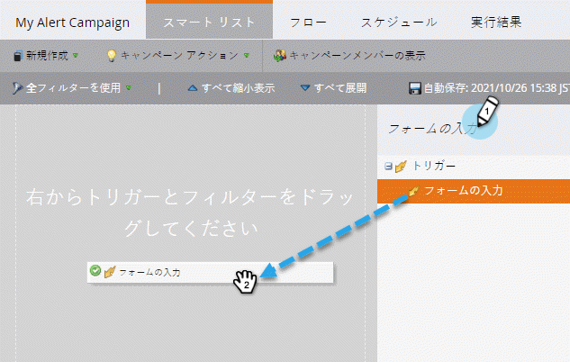
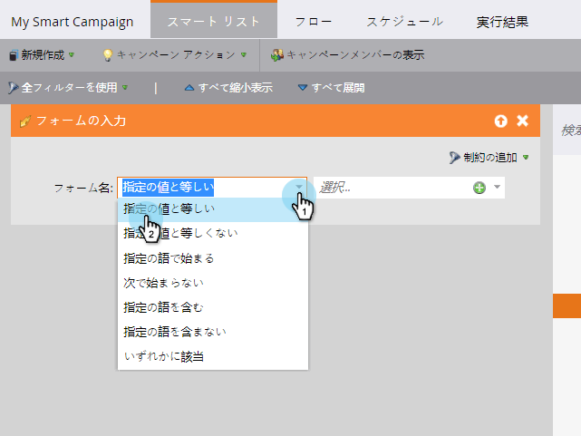
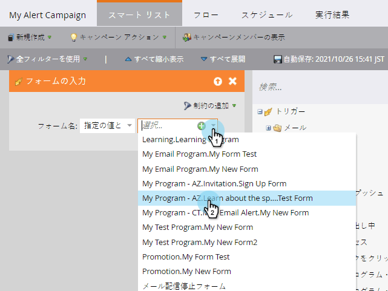

# スマートキャンペーンのスマートリストの定義 |トリガー {#define-smart-list-for-smart-campaign-trigger}

トリガーを追加して、実イベントに基づいて、一度に1人の人に対してスマートキャンペーンを実行できます。

1. スマートキャンペーンで、「**スマートリスト**」タブをクリックします。

   

1. トリガーを検索し、トリガーをキャンバスにドラッグ&amp;ドロップします。

   

   >[!NOTE]
   >
   >トリガーを持つスマートキャンペーンは、 **Trigger** モードで実行されます。 トリガーされるイベントと追加のフィルターに基づいて、一度に1人のユーザーに対して実行されます。

1. ドロップダウンをクリックし、演算子を選択します。

   

   >[!CAUTION]
   >
   >赤い波線は、エラーまたは情報がないことを示します。 修正しないと、キャンペーンは無効になり、実行されません。

   >[!TIP]
   >
   >トリガーとフィルターの両方を備えたスマートキャンペーンでは、トリガーが一番上に表示され、トリガーがトリガーされると、フィルター条件を満たす訪問者のみがフローを通過します。

1. トリガーを定義します。

   

   >[!NOTE]
   >
   >複数のトリガーを使用する場合、 **いずれかのトリガーがアクティブ化されると** 、個人がフローを通過します。

   [スマートキャンペーンのスマートリストの定義 |バッチ](define-smart-list-for-smart-campaign-batch.md)

   >[!NOTE]
   >
   >**関連記事**
   >
   >    
   >    
   >    * [スマートキャンペーンのスマートリストの定義 |バッチ](define-smart-list-for-smart-campaign-batch.md)
   >    * [スマ追加ートキャンペーンへのフローステップ](../../../../product-docs/core-marketo-concepts/smart-campaigns/flow-actions/add-a-flow-step-to-a-smart-campaign.md)

一連のユーザーに対してキャンペーンを同時に実行するには、の方法を学習します。