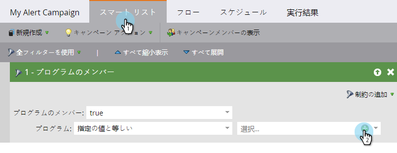
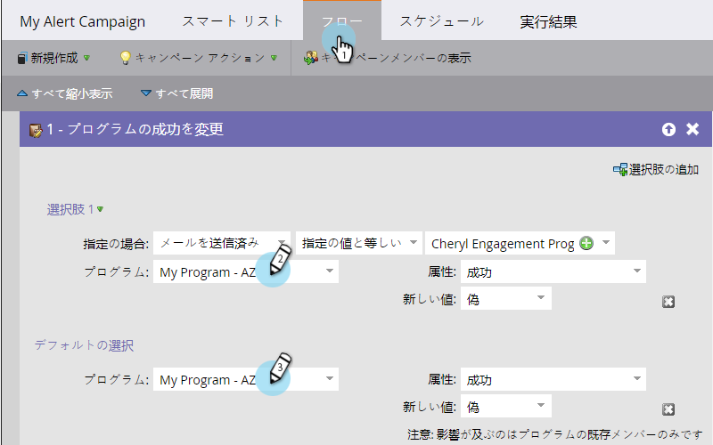
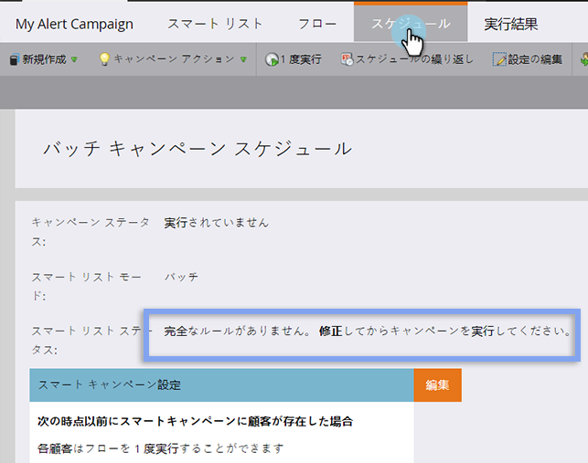

# スマートキャンペーンのチェックリスト {#smart-campaign-checklist}

スマートキャンペーンを円滑に実行し、エラーをできるだけ防ぐには、次の手順に従います。

## スマートリストのエラーの除去 {#get-rid-of-smart-list-errors}

スマートキャンペーンで、 **スマートリスト**. 赤い波線が下に表示されている部分はエラー箇所なので、すべて修正します。

>[!TIP]
>
>赤い波線は、エラーまたは情報が見つからないことを示します。修正されない場合、キャンペーンは無効になり、実行されません。
>
>また、**シンプルな構成**&#x200B;のスマートリストを心がけるようにします。何十、あるいは何百ものフィルターが含まれる場合、維持とトラックが困難になります。フィルターが少ないほどロード時間も速まります。

>[!NOTE]
>
>**スマートリストのメンバー**&#x200B;を使用した場合、他のリストにエラーが発生することがあるので、この点も問題がないか確認します。

## フローのエラーの除去 {#get-rid-of-flow-errors}

スマートキャンペーンで、 **フロー**. 赤い波線が表示されている部分はエラー箇所なので、すべて修正します。

>[!TIP]
>
>赤い波線の箇所にマウスオーバーすると、エラーの詳細が表示されます。

## 「スケジュール」タブのレビュー {#review-the-schedule-tab}

内 **スケジュール** タブ、チェック **スマート** **リスト** **ステータス** 修正が必要なスマートキャンペーンのエラー。

## リード制限数の確認 {#check-person-restrictions-limit}

「**スケジュール**」タブ内で、条件を満たすリード数がリード制限数を越えていないかを確認します。

>[!TIP]
>
>必要に応じて、 [スマートキャンペーンでの担当者制限の上書き](/help/marketo/product-docs/core-marketo-concepts/smart-campaigns/using-smart-campaigns/override-person-restrictions-in-a-smart-campaign.md).

>[!NOTE]
>
>**リマインダー**
>
>それでもスマートキャンペーンが失敗する場合は、 [通知について](/help/marketo/product-docs/core-marketo-concepts/miscellaneous/understanding-notifications.md) 何が起こったのか、どのように修正すればよいのかを調べるために

完成です。スマートキャンペーンを実行する前に、このチェックリストを手元に用意してください。
