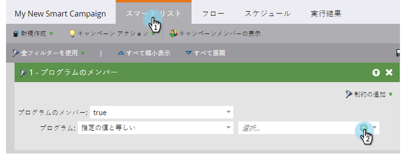
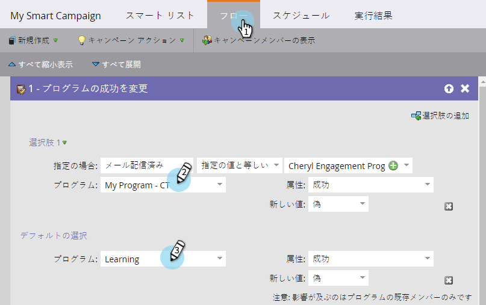
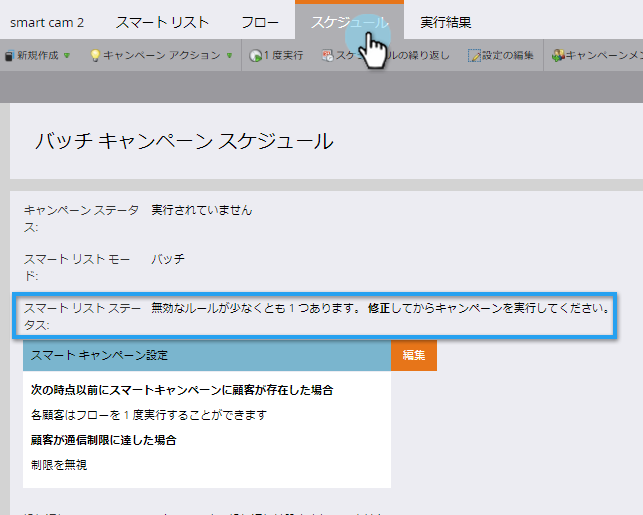

# スマートキャンペーンチェックリスト {#smart-campaign-checklist}

次の手順に従って、スマートキャンペーンの実行をスムーズにし、エラーをできるだけ回避します。

1. スマートリストエラーを取り除く

   スマートキャンペーンで、「 **スマートリスト**」をクリックします。 エラーを修正して、赤い波線を除去します。

   

   >[!TIP]
   >
   >赤い波線は、エラーまたは情報がないことを示します。 修正しないと、キャンペーンは無効になり、実行されません。
   >
   >
   >また、物事を簡単に **しておき**&#x200B;ます。 数十から数百のフィルターがある場合は、それを維持し追跡を維持するのは困難です。 また、読み込むフィルターの数が少なくなると、読み込み時間が短くなります。

   >[!NOTE]
   >
   >**Reminder**
   >
   >
   >スマート **リストのメンバを使用すると** 、その他のリストでエラーが発生する場合があります。 あそこも調べて。

1. フローエラーを取り除く
1. スマートキャンペーンで、「 **フロー**」をクリックします。 エラーを修正して、赤い波線を除去します。

   

   >[!TIP]
   >
   >赤い波線の上にマウスポインターを置くと、エラーの詳細が表示されます。

1. 「スケジュール」タブの確認
1. 「 **Schedule** (スケジュール **)」タブで、「** Smart **リスト****** ・ステータス」にチェックを付け、修正が必要なスマート・キャンペーンのエラーが表示されていることを確認します。

   

1. 個人制限のチェック
1. 「 **スケジュール** 」タブで、資格を持つ人の数が個人の制限の制限を超えていないことを確認します。

   

   >[!TIP]
   >
   >必要に応じて、スマートキャンペーンの個人制限を [上書きできます](../../../../product-docs/core-marketo-concepts/smart-campaigns/using-smart-campaigns/override-person-restrictions-in-a-smart-campaign.md)。

>[!NOTE]
>
>**Reminder**
>
>それでもスマートキャンペーンに障害が発生する場合は、通知を [理解し](../../../../product-docs/core-marketo-concepts/miscellaneous/understanding-notifications.md) 、問題の原因を突き止める方法と修正方法を学びます。

素晴らしい仕事！ スマートキャンペーンを実行する前に、このチェックリストを手元に置いておきます。