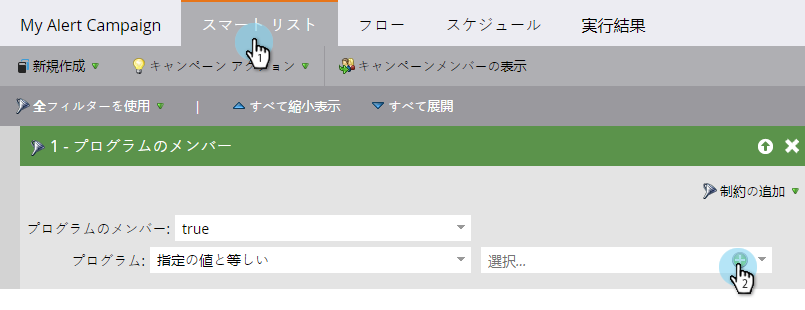
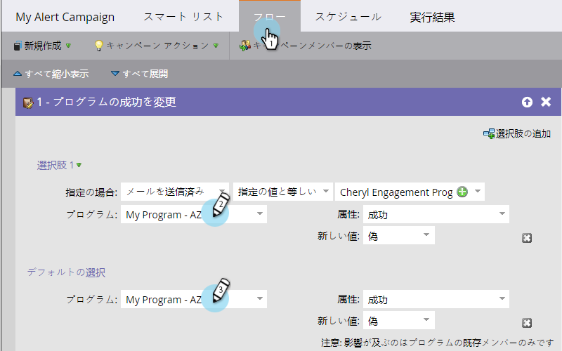
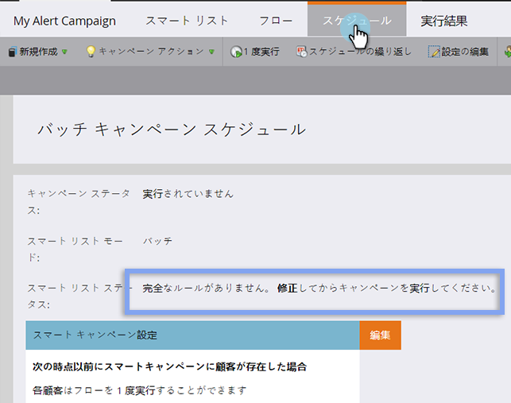
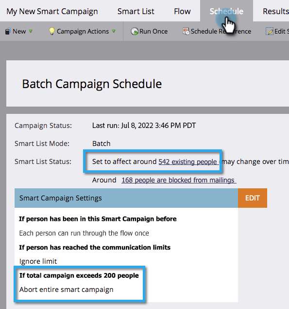

# スマートキャンペーンのチェックリスト {#smart-campaign-checklist}

スマートキャンペーンをスムーズに実行し、可能な限りエラーを防ぐには、以下の手順に従います。

## スマートリストのエラーの除去 {#get-rid-of-smart-list-errors}

スマートキャンペーンで、「**[!UICONTROL スマートリスト]**」をクリックします。 赤い波線が下に表示されている部分はエラー箇所なので、すべて修正します。

>[!TIP]
>
>赤い波線は、エラーまたは情報が見つからないことを示します。 修正されない場合、キャンペーンは無効になり、実行されません。
>
>シンプルなユースケースを。 何十個または何百個ものフィルターがある場合、それを維持して追跡するのは困難です。 フィルターが少ないほどロード時間も速まります。

>[!NOTE]
>
>**[!UICONTROL スマートリストのメンバー]**&#x200B;を使用した場合、他のリストにエラーが発生することがあるので、 この点も問題がないか確認します。

## フローのエラーの除去 {#get-rid-of-flow-errors}

スマートキャンペーンで、「**[!UICONTROL 結果]**」をクリックします。 赤い波線が表示されている部分はエラー箇所なので、すべて修正します。

>[!TIP]
>
>赤い波線の箇所にマウスオーバーすると、エラーの詳細が表示されます。

## 「スケジュール」タブのレビュー {#review-the-schedule-tab}

「**[!UICONTROL スケジュール]**」タブで、**[!UICONTROL スマートリストステータス]**&#x200B;で、修正が必要なスマートキャンペーンのエラーを確認します。

## リード制限数の確認 {#check-person-restrictions-limit}

「**[!UICONTROL スケジュール]**」タブで、適格なユーザーの数がユーザー制限の制限を超えていないことを確認します。

>[!TIP]
>
>必要に応じて、[スマートキャンペーンでリード制限数を上書き](/help/marketo/product-docs/core-marketo-concepts/smart-campaigns/using-smart-campaigns/override-person-restrictions-in-a-smart-campaign.md)できます。

>[!NOTE]
>
>**リマインダー**
>
>以上を行ってもスマートキャンペーンがうまく機能しない場合、何が原因でどこを修正すればいいのか、[通知の内容によく目を通して詳細を確認](/help/marketo/product-docs/core-marketo-concepts/miscellaneous/understanding-notifications.md)してください。

スマートキャンペーンを実行するときは、常にこのチェックリストで内容を点検してください。
