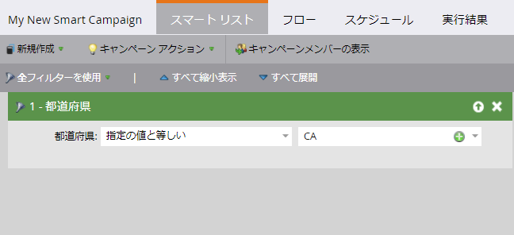
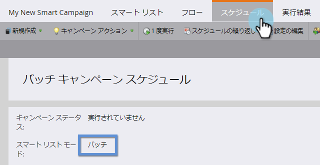
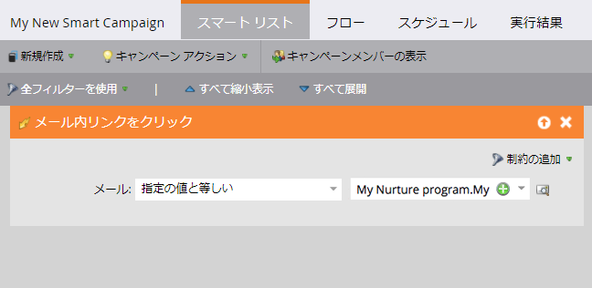
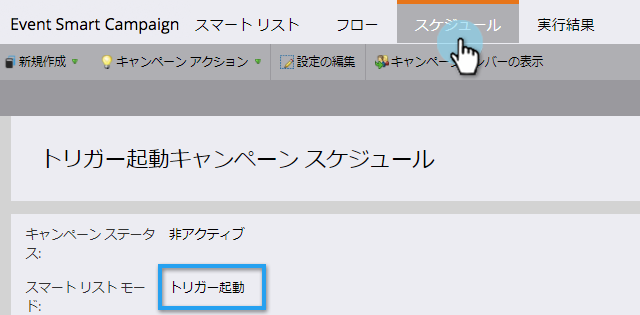

# バッチおよびトリガースマートキャンペーンについて{#understanding-batch-and-trigger-smart-campaigns}

スマートキャンペーンには2種類あります。バッチとトリガー。

## バッチスマートキャンペーン{#batch-smart-campaign}

>[!NOTE]
>
>**定義**
>
>バッチキャンペーンは、特定の時刻に起動し、特定の一連のユーザーにすべて同時に影響します。 例えば、カリフォルニアの全人に電子メールを送信する場合です。

バッチスマートキャンペーンは、スマートリストセクション内のフィルターのみを持ちます(トリガーは持ちません)。

「**スケジュール**」タブをクリックすると、スマートキャンペーンが「バッチ」に設定されていることが確認されます。

**バッチスマートキャンペーン**

* 毎日、毎週、毎月など、繰り返しのスケジュールを設定できます。 1回だけ実行させることもできます。
* [プログラムスケジュール表示](/help/marketo/product-docs/core-marketo-concepts/programs/program-schedule-view/navigating-the-program-schedule-view.md)に表示されます。 スマートキャンペーン内の「待機」ステップの後にある項目は、表示に含まれません。

  

## トリガースマートキャンペーン{#trigger-smart-campaign}

>[!NOTE]
>
>**定義**
>
>トリガースマートキャンペーンは、トリガーされたイベントに基づいて、一度に1人の人に影響を与える。 トリガーの例としては、電子メール内のリンクをクリックします。

スマート・キャンペーンがスマート・リスト・セクション内で少なくとも1つのトリガーを使用する場合、モードは自動的にトリガーに設定されます。

「**スケジュール**」タブをクリックすると、スマートキャンペーンが「トリガー済み」に設定されていることが確認されます。

**トリガースマートキャンペーン**

* 繰り返しのスケジュールは設定できません。 アクティブまたは非アクティブに設定することのみ可能です。
* 複数のトリガーを設定できます。 ただし、トリガーが発生した場合は、キャンペーンのアクションが実行されます。

>[!TIP]
>
>[アクティビティログ](/help/marketo/product-docs/core-marketo-concepts/smart-lists-and-static-lists/managing-people-in-smart-lists/locate-the-activity-log-for-a-person.md)を使用して、スマートキャンペーン内で何が順を追って発生したかを確認します。 アクティビティログは、ユーザーの詳細ページの最後のタブに表示されます。
