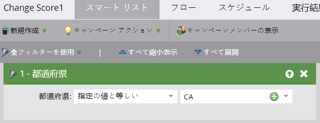
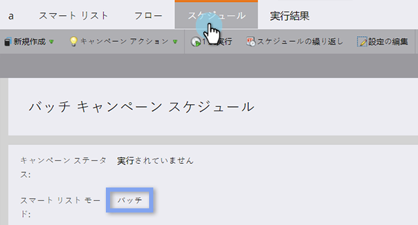
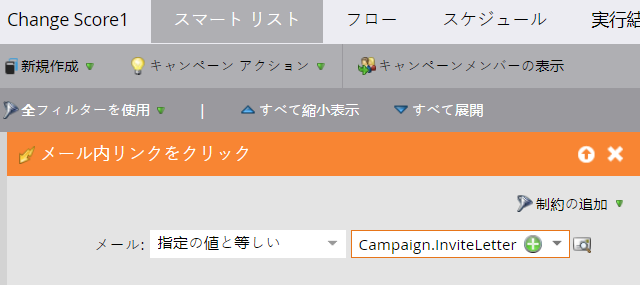
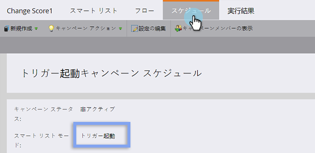

# バッチおよびトリガースマートキャンペーンについて {#understanding-batch-and-trigger-smart-campaigns}

スマートキャンペーンには、バッチおよびトリガーの 2 種類があります。

## バッチキャンペーン {#batch-campaign}

>[!NOTE]
>
>**定義**
>
>バッチキャンペーンは、特定の時間に起動し、すべての特定のユーザーのセットに一度に影響を与えます。 例えば、「東京都」にいるすべてのリードにメールを送信する場合に使用します。

バッチキャンペーンには、スマートリストセクション内のフィルターのみが含まれます ( つまり、トリガーは含まれません )。

クリック **[!UICONTROL スケジュール]** タブで、スマートキャンペーンが「バッチ」に設定されていることを確認します。

**バッチスマートキャンペーン**

* 毎日、毎週、毎月のように、反復するスケジュール設定が可能です。あるいは、単発で 1 回のみ実行するよう設定することも可能です。
* [プログラムスケジュール表示](/help/marketo/product-docs/core-marketo-concepts/programs/program-schedule-view/navigating-the-program-schedule-view.md){target="_blank"}に表示されます。スマートキャンペーン内の「待機」ステップの後は、ビューに含まれません。

  

## トリガーキャンペーン {#trigger-campaign}

>[!NOTE]
>
>**定義**
>
>トリガーキャンペーンは、トリガーされたイベントに基づいて、一度に 1 人の人に影響を与えます。 例えば、メール内のリンクがクリックされた場合です。

スマートキャンペーンが「スマートリスト」セクション内で少なくとも 1 つのトリガーを使用する場合、モードは自動的にトリガーに設定されます。

クリック **[!UICONTROL スケジュール]** タブで、スマートキャンペーンが「トリガー」に設定されていることを確認します。

**トリガーキャンペーン**

* 反復するスケジュール設定はできません。アクティブまたは非アクティブの設定のみです。
* トリガーは複数設定できます。ただし、いずれかのトリガーが起動した場合に、当該キャンペーンが実行されます。

>[!TIP]
>
>以下を使用します。 [アクティビティログ](/help/marketo/product-docs/core-marketo-concepts/smart-lists-and-static-lists/managing-people-in-smart-lists/locate-the-activity-log-for-a-person.md){target="_blank"} を参照して、スマートキャンペーン内でのステップバイステップの発生を確認します。 アクティビティログは、各リードの詳細ページにある一番右側のタブから確認できます。
