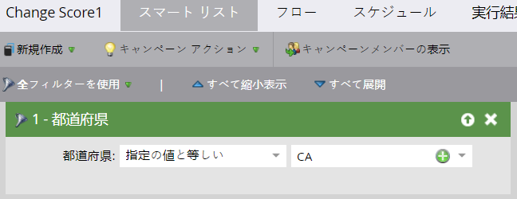
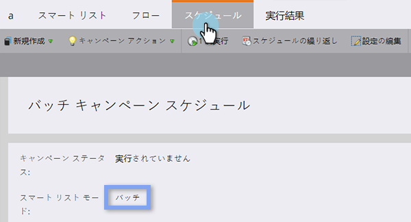
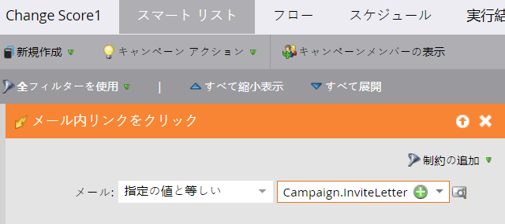
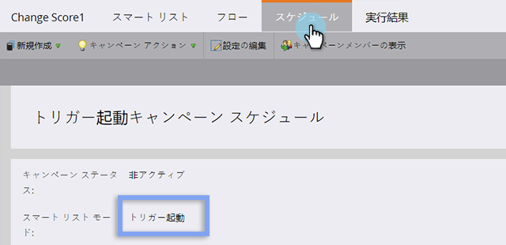

# バッチおよびトリガースマートキャンペーンについて {#understanding-batch-and-trigger-smart-campaigns}

スマートキャンペーンには、バッチおよびトリガーの 2 種類があります。

## バッチキャンペーン {#batch-campaign}

>[!NOTE]
>
>**定義**
>
>バッチキャンペーンは、特定の時間に開始され、特定の一連のユーザーに一括で影響を与えます。 例えば、「東京都」にいるすべてのリードにメールを送信する場合に使用します。

バッチキャンペーンには、スマートリストセクション内のフィルターのみが含まれます（トリガーはありません）。

「**[!UICONTROL スケジュール]**」タブをクリックすると、スマートキャンペーンが「バッチ」に設定されていることを確認できます。

**バッチスマートキャンペーン**

* 毎日、毎週、毎月のように、繰り返しのスケジュール設定が可能です。 あるいは、単発で 1 回のみ実行するよう設定することも可能です。
* [プログラムスケジュール表示](/help/marketo/product-docs/core-marketo-concepts/programs/program-schedule-view/navigating-the-program-schedule-view.md){target="_blank"}に表示されます。 スマートキャンペーン内の「待機」ステップの後のものは、ビューに含まれません。

  

## トリガーキャンペーン {#trigger-campaign}

>[!NOTE]
>
>**定義**
>
>トリガー施策は、トリガーされたイベントにもとづいて、一人ひとりに影響を与えます。 例えば、メール内のリンクがクリックされた場合です。

スマートキャンペーンで「スマートリスト」セクション内の少なくとも1つのトリガーを使用すると、自動的にトリガーされます。

「**[!UICONTROL スケジュール]**」タブをクリックすると、スマートキャンペーンが「トリガー」に設定されていることを確認できます。

**トリガーキャンペーン**

* 繰り返しのスケジュール設定はできません。 アクティブまたは非アクティブの設定のみです。
* トリガーは複数設定できます。 ただし、いずれかのトリガーが起動した場合に、当該キャンペーンが実行されます。

>[!TIP]
>
>[ アクティビティログ ](/help/marketo/product-docs/core-marketo-concepts/smart-lists-and-static-lists/managing-people-in-smart-lists/locate-the-activity-log-for-a-person.md){target="_blank"}を使用して、スマートキャンペーン内で発生したステップバイステップを確認します。 アクティビティログは、各リードの詳細ページにある一番右側のタブから確認できます。
