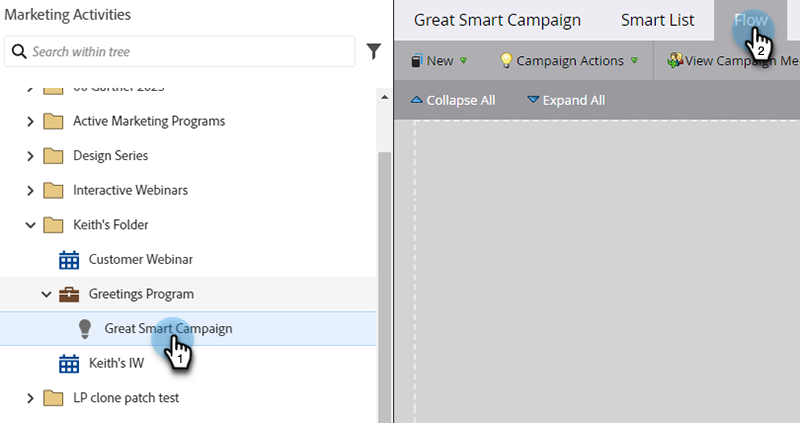

# スマートキャンペーンへのフローステップの追加 {#add-a-flow-step-to-a-smart-campaign}

フロー手順は、選定された人物のグループに対して何を実行するかをMarketo Engageに指示します。

1. 「**[!UICONTROL マーケティングアクティビティ]**」に移動します。

   

1. スマートキャンペーンを選択して「**[!UICONTROL フロー]**」をクリックします。

   

1. フローステップを入力して検索し、それをキャンバスにドラッグ＆ドロップします。複数のフローステップを追加できます。キャンペーンで実行するすべてのステップに対して同じ操作を繰り返してください。

   

1. 目的のオプションと値をクリックします。

   

>[!NOTE]
>
>フローステップは、リストに表示されている順序で実行されます。 適切な順序で実行されるように、[フローステップを並べ替え](/help/marketo/product-docs/core-marketo-concepts/smart-campaigns/flow-actions/reorder-the-flow-steps-in-a-smart-campaign.md){target="_blank"}てください。

>[!TIP]
>
>入力が無効な場合には、赤色の線が表示されます。この赤線の上にカーソルを置くと、修正方法を確認できます。

これで完了です。スマートキャンペーンをスケジュールまたはアクティブ化する前に、必ず [ スマートキャンペーンをレビューおよび検証 ](/help/marketo/product-docs/core-marketo-concepts/smart-campaigns/creating-a-smart-campaign/smart-campaign-checklist.md){target="_blank"} してください。

>[!MORELIKETHIS]
>
>* [フローステップでの「選択肢を追加」の使用](/help/marketo/product-docs/core-marketo-concepts/smart-campaigns/flow-actions/use-add-choice-in-a-flow-step.md){target="_blank"}
>* [スマートキャンペーンでのフローステップの並べ替え](/help/marketo/product-docs/core-marketo-concepts/smart-campaigns/flow-actions/reorder-the-flow-steps-in-a-smart-campaign.md){target="_blank"}
