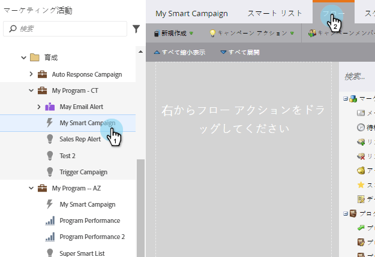
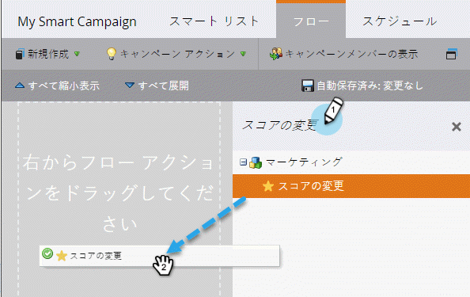
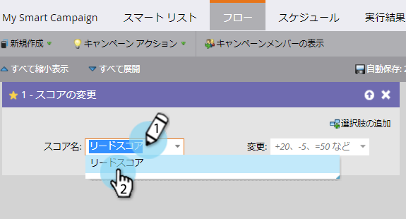
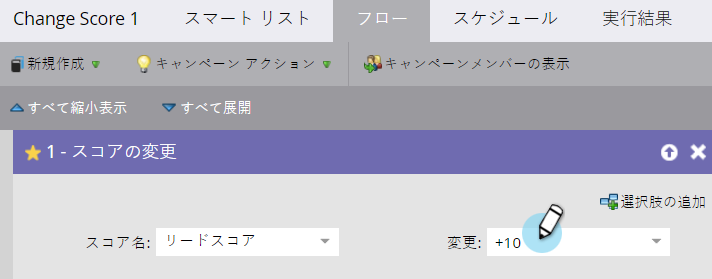

# ス追加マートキャンペーンへのフローステップ{#add-a-flow-step-to-a-smart-campaign}

フローステップは、資格を得たグループに何を起こしたいかをマーケティング担当者に伝えます。 彼らはあなたの指示で、賢いキャンペーンはあなたの指示を守る！

1. **マーケティングアクティビティ**&#x200B;に移動します。

   

1. スマートキャンペーンを選択し、「**フロー**」をクリックします。

フローステップを検索するには、と入力し、キャンバスにドラッグ&amp;ドロップします。 複数のフローステップを追加できます。キャンペーンが実行する各ステップに対してこの手順を繰り返します。

>[!NOTE]
>
>**ディープダイブ**
>
>
>様々な[フローステップ](http://docs.marketo.com/display/DOCS/Flow+Actions)の詳細を表示します。

1. ドロップダウンをクリックし、適切なオプションを選択します。

   

   値を入力します。

   

   >[!NOTE]
   >
   >**Reminder**
   >
   >
   >フローステップは、表示された順序で実行されます。  [フロー](add-a-flow-step-to-a-smart-campaign/reorder-the-flow-steps-in-a-smart-campaign.md) ステップの順序を変更し、正しい順序になっていることを確認します。

   >[!TIP]
   >
   >無効なエントリの場合は、赤い波線が表示されます。 線の上にカーソルを置くと、修正方法が表示されます。

   [スマートキャンペーンの確認と検証](../../../../product-docs/core-marketo-concepts/smart-campaigns/creating-a-smart-campaign/smart-campaign-checklist.md)

   >[!NOTE]
   >
   >**関連記事**
   >
   >    
   >    
   >    * [フローステップでの追加選択の使用](use-add-choice-in-a-flow-step.md)
   >    * [スマートキャンペーンでのフローステップの並べ替え](add-a-flow-step-to-a-smart-campaign/reorder-the-flow-steps-in-a-smart-campaign.md)

すごい！ スケジュールを設定したり、アクティブにする前に、に注意してください。