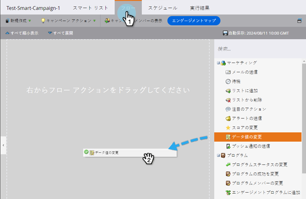
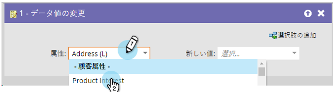
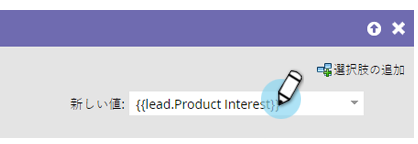
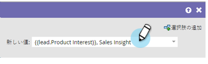

# フィールドへのデータ追加 {#append-data-to-a-field}

フィールドにデータを簡単に追加する方法があります。手順は以下のとおりです。

>[!PREREQUISITES]
>
>[キャンペーンの作成](/help/marketo/product-docs/core-marketo-concepts/smart-campaigns/creating-a-smart-campaign/create-a-new-smart-campaign.md){target="_blank"}

>[!NOTE]
>
>以下の手順は、[プログラムメンバーデータの変更](/help/marketo/product-docs/core-marketo-concepts/smart-campaigns/program-flow-actions/change-program-member-data.md){target="_blank"}にも適用できます。

1. 「**[!UICONTROL フロー]**」タブで「**[!UICONTROL データ値の変更]**」フローステップにドラッグします。

   

1. データを追加するフィールドを見つけて選択します。

   

1. データの追加先と同じフィールドのトークンを見つけて選択します。

   

1. 次に、既にフィールドに存在する値に追加する値を追加します。

   

これで完了です。クリエイティブを発揮して複数のトークンを追加できます。
