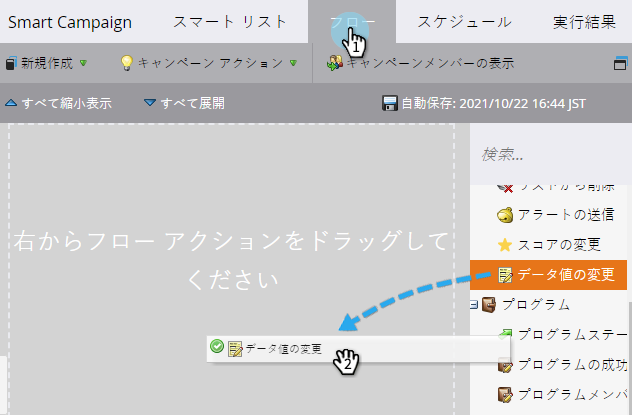
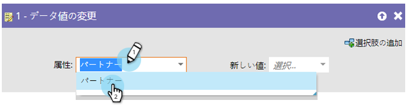
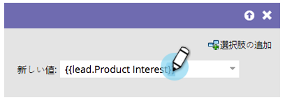
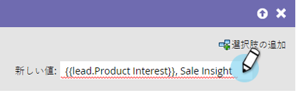

# フィールドにデータを追加 {#append-data-to-a-field}

フィールドにデータを簡単に追加する方法があります。 これが方法です。

>[!PREREQUISITES]
>
>* [キャンペーンの作成](../../../../product-docs/core-marketo-concepts/smart-campaigns/creating-a-smart-campaign/create-a-new-smart-campaign.md)

>

1. 「 **フロー** 」(Flow **)タブで、「データ値を** 変更」(Change Data Value)フローステップをドラッグします。

   

1. データを追加するフィールドを探して選択します。

   

1. データを追加するフィールドと同じフィールドのトークンを探して選択します。

   

1. フィールドに既に存在する値に付加する値を追加します。

   

   それだ！ クリエイティブを取得し、そこに複数のトークンを追加できます。

