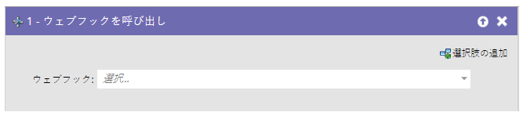
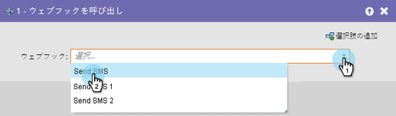

# Webフック{#call-webhook}を呼び出す

>[!PREREQUISITES]
>
>* [Webフックの作成](../../../../product-docs/administration/additional-integrations/create-a-webhook.md)

>

## 概要{#overview}

Webhookを使用すると、サードパーティのサービスとやり取りできます。 スマートキャンペーンフローでWebフックを呼び出して、情報を送受信します。

>[!NOTE]
>
>**ディープダイブ**
>
>[Webhooks](http://developers.marketo.com/documentation/webhooks/)があなたに役立つ素晴らしいことを学びましょう。

## 使用法{#usage}

ドロップダウンから&#x200B;**Webhook**&#x200B;を選択します。

それだけだ！ ユーザーがスマートキャンペーンフローに入るたびに、Webフックが呼び出されるようになりました。

>[!NOTE]
>
>**関連記事**
>
>* [スマートキャンペーンでのWebフックの使用](use-a-webhook-in-a-smart-campaign.md)

>

