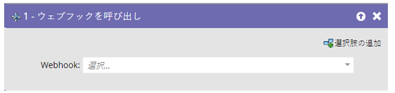
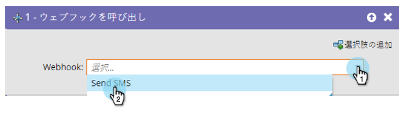

# Web フックの呼び出し {#call-webhook}

>[!PREREQUISITES]
>
>[Web フックの作成](/help/marketo/product-docs/administration/additional-integrations/create-a-webhook.md){target="_blank"}

Web フックを使用すると、サードパーティのサービスとやり取りできます。スマートキャンペーンフローで Web フックを呼び出して情報を送受信します。

>[!NOTE]
>
>[Webhook](https://experienceleague.adobe.com/en/docs/marketo-developer/marketo/webhooks/webhooks){target="_blank"} で実現できる魅力的な機能について説明します。

1. ドロップダウンから Webhook を選択します。

これだけです。これで、ユーザーがスマートキャンペーンフローに入るたびに web フックが呼び出されるようになります。

>[!MORELIKETHIS]
>
>[スマートキャンペーンでの web フックの使用](/help/marketo/product-docs/core-marketo-concepts/smart-campaigns/flow-actions/use-a-webhook-in-a-smart-campaign.md){target="_blank"}
