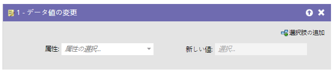
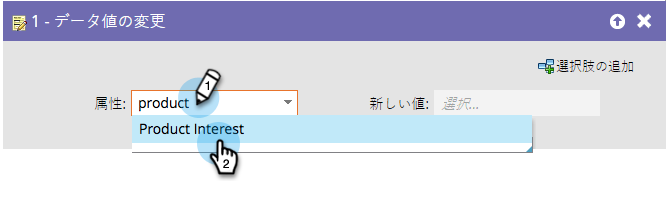
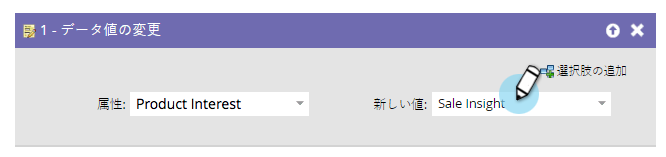

# データ値の変更{#change-data-value}

## 概要{#overview}

マーケティングツールを使用して、フィールドの値を更新できます。 この場合、「**データ値の変更**フロー」アクションを使用します。

>[!NOTE]
>
>また、フィールドの更新をブロックすることもできます。 詳しくは、[フィールドの更新をブロック](../../../../product-docs/administration/field-management/block-updates-to-a-field.md)を参照してください。

## 使用法{#usage}

1. 値を変更するフィールドを探して選択します。

   

1. 必要な値を入力すると、完了です。

   

   >[!NOTE]
   >
   >**Reminder**
   >
   >
   >また、**新しい値**&#x200B;でトークンを使用することもできます。

   >[!TIP]
   >
   >「**新しい値**」に「NULL」（引用符なし、すべて大文字）を入力すると、フィールドをクリアできます。 詳しくは、[フィールド値をクリア](change-data-value/clear-field-values.md)を参照してください。

   >[!NOTE]
   >
   >**関連記事**
   >
   >    
   >    
   >    * [フローステップのトークン](use-tokens-in-flow-steps.md)
   >    * [フィールドにデータを追加](append-data-to-a-field.md)

