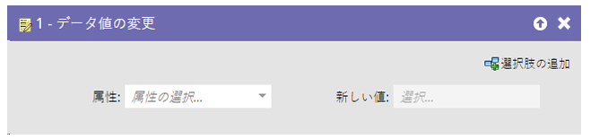
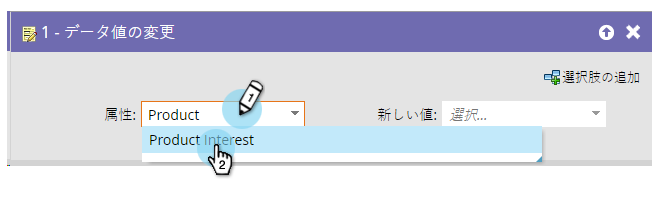
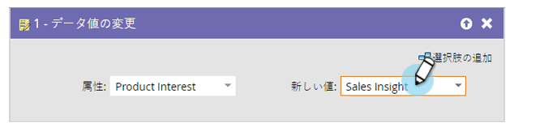

# データ値の変更 {#change-data-value}

Marketo を使用して、フィールドの値を更新できます。更新するには、**[!UICONTROL データ値を変更]**&#x200B;フローアクションを使用します。

>[!NOTE]
>
>また、フィールドが更新されないようにブロックすることもできます。詳細については、[フィールドの更新をブロック](/help/marketo/product-docs/administration/field-management/block-updates-to-a-field.md){target="_blank"}を参照してください。

1. 値を変更するフィールドを検索して選択します。

   

1. 値を入力します。

   

   >[!NOTE]
   >
   >「**[!UICONTROL 新しい値]**」にはトークンを使用できます。

   >[!TIP]
   >
   >「**[!UICONTROL 新しい値]**」に「NULL」（括弧を含まず、すべて大文字）と入力することで、フィールドをクリアできます。詳細については、[フィールド値を消去](/help/marketo/product-docs/core-marketo-concepts/smart-campaigns/flow-actions/clear-field-values.md){target="_blank"}を参照してください。

   >[!NOTE]
   >
   >* [フローステップのトークン](/help/marketo/product-docs/core-marketo-concepts/smart-campaigns/flow-actions/use-tokens-in-flow-steps.md){target="_blank"}
   >* [フィールドへのデータ追加](/help/marketo/product-docs/core-marketo-concepts/smart-campaigns/flow-actions/append-data-to-a-field.md){target="_blank"}
