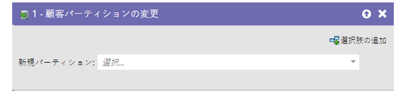
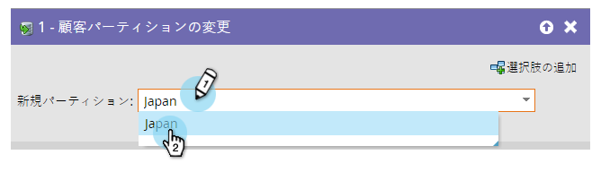

# リードパーティションの変更 {#change-person-partition}

[ワークスペースとパーティション](/help/marketo/product-docs/administration/workspaces-and-person-partitions/understanding-workspaces-and-person-partitions.md){target="_blank"}を使用している場合、リードを現在のパーティションから別のパーティションに移動するには、スマートキャンペーンを構築する必要があります。

1. リードを移動するパーティションを選択します。

簡単に設定できますね。
