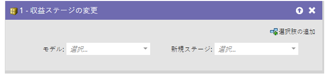
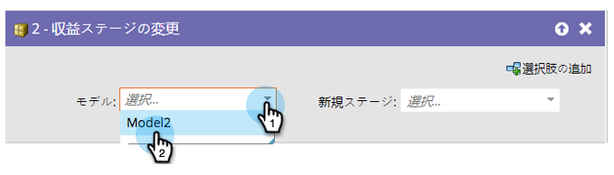
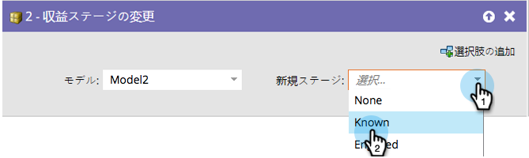

# 売上高変更ステージ{#change-revenue-stage}

## 概要{#overview}

Revenue Cycle Modelerを使用していて、承認済みのモデルがある場合は、あるステージから別のステージにリードを手動で移動することを決定できます。 このフローステップは役立ちます。

## 使用法{#usage}

1. **モデル**&#x200B;を選択します。

   

1. 割り当てる&#x200B;**新しいステージ**&#x200B;を選択すると、完了です。

   

   >[!CAUTION]
   >
   >リードがステージ間を移動するタイミングに細心の注意を払う必要があります。 正しく使用しないと、不正なデータが作成される可能性があります。

