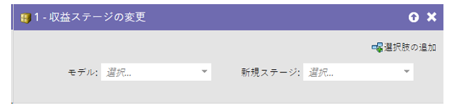
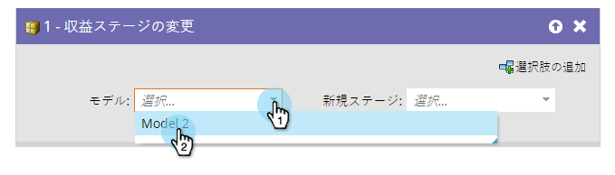
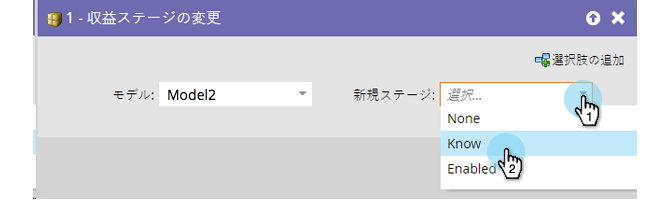

# 売上高ステージの変更 {#change-revenue-stage}

収益サイクルのModelerを使用していて、モデルが承認されている場合は、ユーザーを手動でステージ間を移動させることをお勧めします。 その際、このフローステップが役立ちます。

1. 「**[!UICONTROL モデル]**」を選択します。

   

1. 割り当てる「**[!UICONTROL 新規ステージ]**」を選択したら完了です。

   

   >[!CAUTION]
   >
   >データウェアハウスは、ユーザーがステージ間を移動するタイミングに細心の注意を払います。 これを誤って使用すると不良なデータが生成される恐れがあります。
