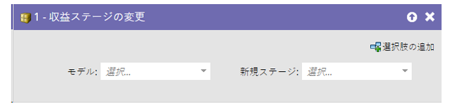
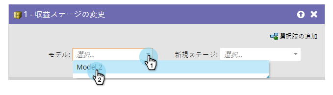
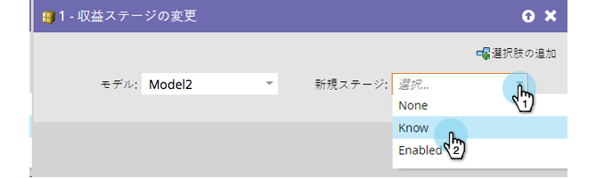

# 売上高ステージの変更 {#change-revenue-stage}

売上高サイクルモデラーを使用しており、かつ承認済みのモデルを有する場合、人物を現在のステージから別のステージに手動で移動する必要が生じるかもしれません。その際、このフローステップが役立ちます。

1. 「**[!UICONTROL モデル]**」を選択します。

   

1. 割り当てる「**[!UICONTROL 新規ステージ]**」を選択したら完了です。

   

   >[!CAUTION]
   >
   >データウェアハウス側は人物がステージ間を移動するタイミングについて細心の注意を払っています。これを誤って使用すると不良なデータが生成される恐れがあります。
