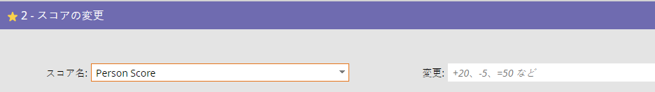
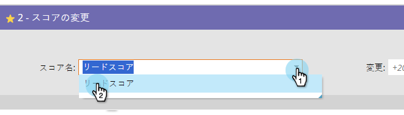
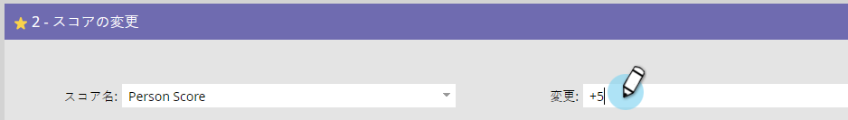

# スコアの変更 {#change-score}

ユーザーのスコアリングは簡単で強力なので、セールスチームが優先順位を付けるのに役立ちます。

1. 変更するスコアのフィールドを選択します。

   

   >[!TIP]
   >
   >さらにスコアのフィールドを作成することができます。詳細については、「[Marketo のカスタムフィールドの作成](/help/marketo/product-docs/administration/field-management/create-a-custom-field-in-marketo.md){target="_blank"}」を参照してください。

1. スコアの変更を入力します。

   

   変更：

   * 増やすには「**+5**」のように入力します
   * 減らすには「**-5**」のように入力します（マイナスの値を入力できます）
   * 値を指定するには「**=5**」のように入力します
   * マイナスの値を指定するには「**=-5**」のように入力します

いくつかの基本的なスコアリングを素早く取得し、結果を経時的に調整します。
