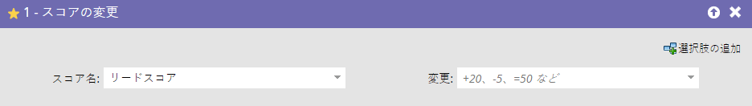
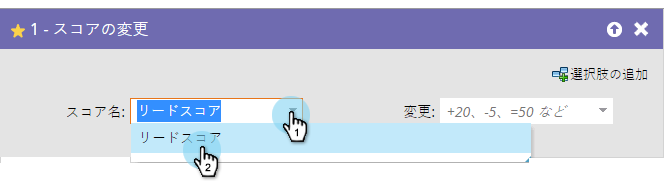
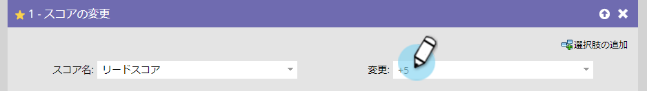

# スコアの変更{#change-score}

## 概要{#overview}

スコア決定は、販売チームが優先順位を決定するのに役立つ、簡単で強力な人です。

## 使用法{#usage}

1. 変更するスコアフィールドを選択します。

   

   >[!TIP]
   >
   >複数のスコアフィールドを作成できます。 詳しくは、「Marketo[でのカスタムフィールドの作成」を参照してください。](../../../../product-docs/administration/field-management/create-a-custom-field-in-marketo.md)

1. 変更するスコアを入力します。

   

   変更：

   * **+5** で増分
   * **-5** はデクリメントします（負の数を指定できます）
   * **=5** は、正確な数値になる
   * **=-5** は、正の負の数のスコアになります

   基本的なスコアをすばやく決め、時間の経過とともに結果を調整します。 そうしたの！

