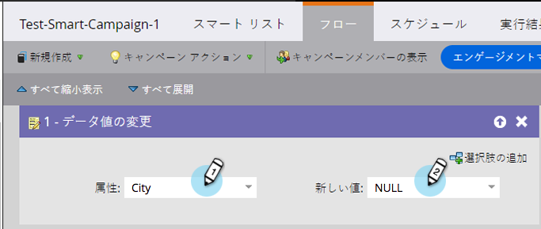

# フィールド値のクリア {#clear-field-values}

[データ値の変更](/help/marketo/product-docs/core-marketo-concepts/smart-campaigns/flow-actions/change-data-value.md)は便利ですが、値を完全に&#x200B;_削除_&#x200B;するには、どうすればいいでしょう？良い質問です。

1. フローステップで、クリアするフィールドを選択し、**[!UICONTROL 新しい値]**&#x200B;として **[!UICONTROL NULL]**（すべて大文字）と入力します。

   

1. フローステップが終了すると、選択したフィールドの値がクリアされます。

   

   >[!CAUTION]
   >
   >新しい値を空白のままにしたり、単にスペースを入力したりしても、フィールドは空にはなりません。NULL を入力する必要があります。また、実行後にフローステップを元に戻すことはできません。
