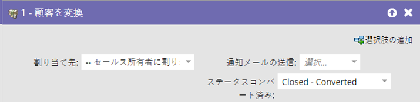
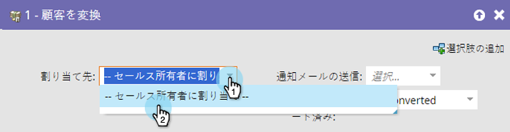
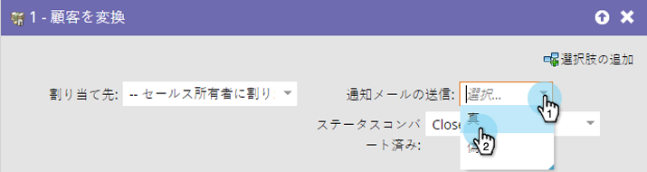
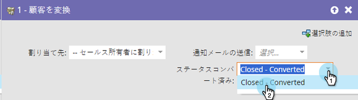

# 人物のコンバージョン {#convert-person}

このフローステップを使用して、人物を [!DNL Salesforce] 内の取引先責任者にコンバージョンします。取引先責任者の割り当て先、所有者への通知の送信先、コンバージョンステータスの設定先を決定できます。

>[!NOTE]
>
>これは、[!DNL Salesforce] と統合されている場合にのみ使用できます。

1. 結果として生じる取引先責任者、アカウント、商談を割り当てる対象を選択します。

   

   >[!CAUTION]
   >
   >Marketo で人物をコンバージョンすると、[!DNL Salesforce] で新しいアカウントと商談が作成されます。アカウントを重複させたくない場合は、[!DNL Salesforce] を使用してコンバージョンします。

1. 所有者に&#x200B;**[!UICONTROL 通知]**&#x200B;を送信するかどうか選択します。

   

1. 「**[!UICONTROL コンバージョンステータス]**」を選択します。

   
