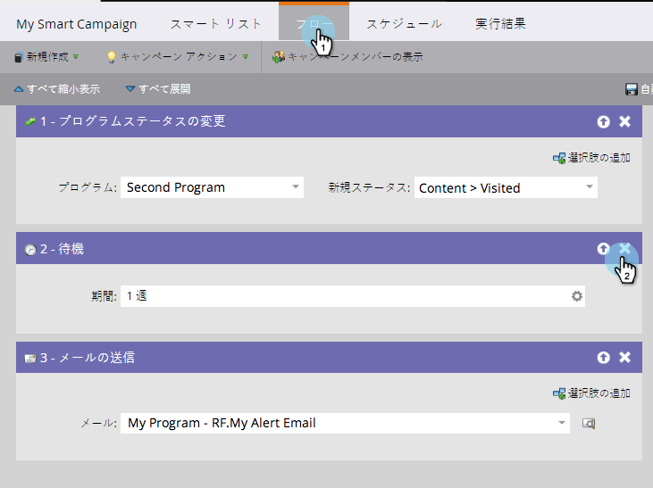

# フローステップの削除 {#delete-a-flow-step}

>[!CAUTION]
>
>フローステップ( *特に、アクティブなスマートキャンペーンから待機ステップ* )を削除すると、予期しない結果が発生する場合があります。 **この記事は注意深く読んでください。**

まずは基本をやりましょう。 スマートキャンペーンから不要なフローステップを削除する方法を次に示します。 1.スマート・キャンペーン・フローで、「X」アイコンをクリックして、フロー・ステップを削除します。

1. 「 **削除**」をクリックします。

   

   簡単で簡単でしょ？ ほとんどの時…

   >[!CAUTION]
   >
   >アクティブな **キャンペーン内のステップを削除、追加、移動すると** 、予期しない結果が生じる可能性がある。 新しいキャンペーンを作成し、テストしてから切り替えることを検討してください。

   アクティブなキャンペーンに変更を加えることはできますが、予期しない結果が生じる可能性があります。 以下に詳細を示します。

   **バッチスマートキャンペーン**

   キャンペーンの場合：

   1. **走らなかった。** 必要な変更をすべて行います。 そのキャンペーンを動かすまで誰にも影響しない。
   1. **スマートキャンペーンが繰り返し発生します。** この変更は、以前の実行ではなく、将来の実行でのユーザーに影響を与えます。
   1. **既にWAITステップなしで実行されています。** 実行後にキャンペーンが休止状態になるため、ユーザーは影響を受けません。
   1. **現在実行中です。** 変更は、削除のタイミングと詳細に応じて、予期しない動作の原因となる場合があります。 アクティブに実行されているバッチキャンペーンを編集しないことを強くお勧めします。 緊急の場合は、実行中のスマートキャンペーンを [中止する方法を説明します](../../../../product-docs/core-marketo-concepts/smart-campaigns/using-smart-campaigns/abort-a-smart-campaign.md)。

   1. **既にWITH待機ステップを実行しています。** この件についての詳細はいくつか。\
      個人が待機ステップに入ると、その人は期間と、どのNUMBER STEPに戻るかをジョトダウンします。 以下の例を参照してください。

   **スマートキャンペーンのトリガー**

   1. **待機ステップなし。** 通常の手順を削除すると、そのキャンペーンを後で実行するユーザーのみが影響を受けます。
   1. **待機ステップ付き。** バッチキャンペーンの例を次に示します。 同じ論理が当てはまる。

   >[!NOTE]
   >
   >**例**
   >
   >    
   >    
   >1. スマートキャンペーンには3つの手順があります。
   >
   >   * 手順1. 電子メール#1の送信
   >   * 手順2. 1週間待つ
   >   * 手順3. 電子メール#2の送信
   >
   >1. ステップ2をヒットし **た訪問者は、ステップ3に進む前に** 1週間待ちます ****。
   >1. この週は **ステップ2** を削除します。
   >1. 人々は1週間待ち続ける。 （自動的にフローに戻ることはありません）。
   >1. 最終的に戻ったら、 **手順3に進みます**。 彼らはそれを見つけられない。
   >1. **重要：** 現在は2つの手順しかないので、 *ユーザーは電子メール#2を受け取りません。*

アクティブなキャンペーンに変更を加える

この機能を理解すると、スマートキャンペーンをマスターできます。 うわあ！
