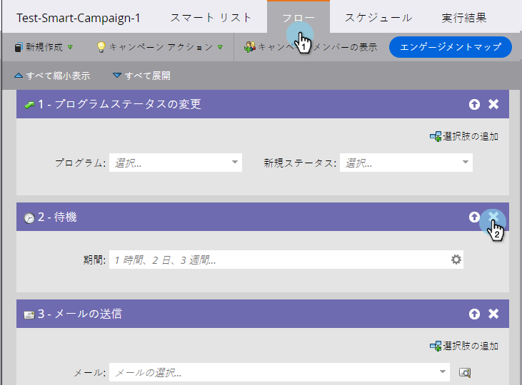
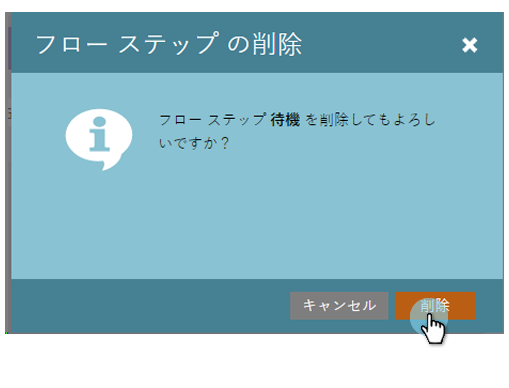

# フローステップの削除 {#delete-a-flow-step}

>[!CAUTION]
>
>フローステップ、_特に待機ステップ_&#x200B;をアクティブなスマートキャンペーンから削除すると、予期しない結果が生じる可能性があります。この記事をよく読んでください。

まず、基本を説明します。スマートキャンペーンから不要なフローステップを削除する方法を以下に示します。

1. スマートキャンペーン&#x200B;**[!UICONTROL フロー]**&#x200B;で、**X** アイコンをクリックして、フローステップを削除します。

   

1. 「**[!UICONTROL 削除]**」をクリックします。

   

   >[!CAUTION]
   >
   >_アクティブ_&#x200B;キャンペーンのステップの削除、追加、移動は、予期しない結果が生じる可能性があります。新しいキャンペーンを作成し、テストして切り替えることを検討してください。

   アクティブなキャンペーンに変更を加えることはできますが、予期しない結果が生じる場合があります。詳細は次のとおりです。

   **バッチスマートキャンペーン**

   キャンペーンが次の場合：

   1. **実行されなかった**。必要な変更をすべて行えます。キャンペーンを実行していなければ誰にも影響しません。
   1. **スマートキャンペーンが繰り返される**。変更は、以前の実行ではなく、今後の実行で人物に影響を与えます。
   1. **既に実行されている（待機ステップなし）**。実行後にキャンペーンは休止状態になるので、影響を受ける人物はいません。
   1. **現在実行中**。変更は、削除のタイミングと詳細に応じて、予期しない動作を引き起こす可能性があります。アクティブに実行中のバッチキャンペーンは編集しないことを強くお勧めします。緊急の場合は、[実行中のスマートキャンペーンを中止する](/help/marketo/product-docs/core-marketo-concepts/smart-campaigns/using-smart-campaigns/abort-a-smart-campaign.md){target="_blank"}方法を参照してください。

   1. **既に実行されている（待機ステップあり）。** この 1 つにいくつかの詳細。
人物が待機ステップに入ると、待機期間と、どのステップ番号に戻るかは記録されます。以下の例を参照してください。

   **トリガースマートキャンペーン**

   1. **待機ステップなし**。通常のステップを削除すると、その後キャンペーンを実行する人物のみが影響を受けます。
   1. **待機ステップあり**。バッチキャンペーンについて詳しくは、以下の例を参照してください。同じ論理が当てはまります。

   >[!NOTE]
   >
   >**例**
   >
   >1. スマートキャンペーンには 3 つの手順があります。
   >    * ステップ 1.メール #1 を送信
   >    * ステップ 2.1 週間待機
   >    * ステップ 3.メール #2 を送信
   >
   >1. **ステップ 2** をヒットした人物は、**ステップ 3**.に進む前に 1 週間待機します。
   >1. その週の間に&#x200B;**ステップ 2** を削除します。
   >1. 人物は引き続き 1 週間待機します（フローに自動的にポップバックすることはありません）。
   >1. 最終的に戻って来たとき、**ステップ 3** に進もうとしますが、見つかりません。
   >1. **重要：**&#x200B;現在は 2 つのステップしかないので、人物には&#x200B;_メール #2 が届きません_。
