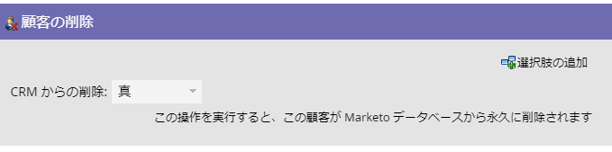
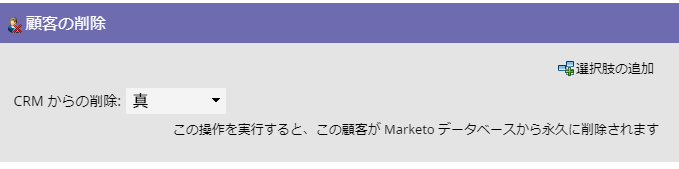
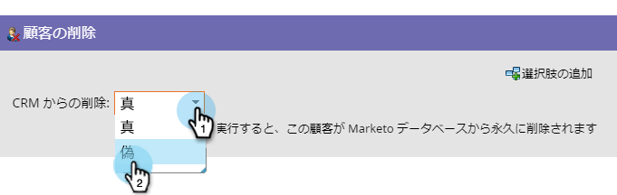

# 人を削除{#delete-person}

誤ったユーザーがデータベースに入り込むことがあります。 「人物の削除」フローステップでは、これらを削除できます。

## 概要{#overview}

スマートキャンペーンのフローステップを使用します。

>[!CAUTION]
>
>個人を削除すると、その個人の履歴RCEデータもすべて削除されます。 この操作は取り消しできません。

## 使用法{#usage}

フローステップをドラッグすると、CRMからも自動的に削除するように設定されます。

次のように、CRMからではなくMarketoから削除できます。

>[!NOTE]
>
>CRM **から人物を削除するのは、Salesforce**&#x200B;でのみ機能します。 Marketoから削除した人をSalesforceで保持するように選択した場合、その人のSalesforceレコードが更新された場合は、Marketoでその人が再作成されます。
