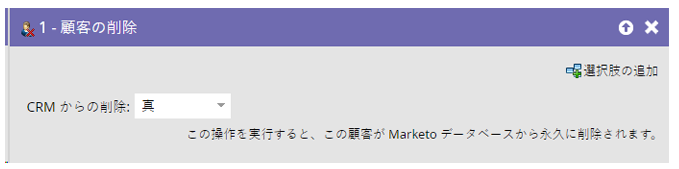
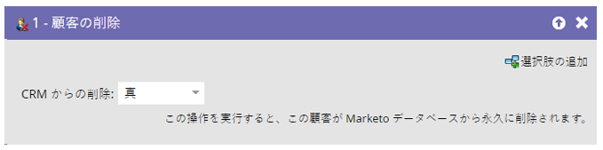
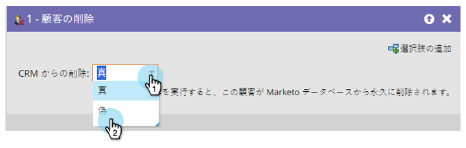

# 人物の削除 {#delete-person}

誤ったユーザーがデータベースに取り込まれることもあります。 人物の削除フローステップで削除できます。

>[!CAUTION]
>
>人物を削除すると、その人物の履歴 RCE データもすべて削除されます。これは元に戻せません。

1. フローステップをドラッグすると、CRM からも自動的に削除されるように設定されます。

   

1. 以下のように、を CRM から削除するのではなく、Marketo Engageから削除できます。

   

>[!NOTE]
>
>CRM からの人物の削除 _[!DNL Salesforce]_ でのみ機能します。 Marketoからユーザーを削除し、そのユーザーを [!DNL Salesforce] に保持することを選択した場合、[!DNL Salesforce] レコードが更新されるたびに、そのユーザーはMarketoで再作成されます。
