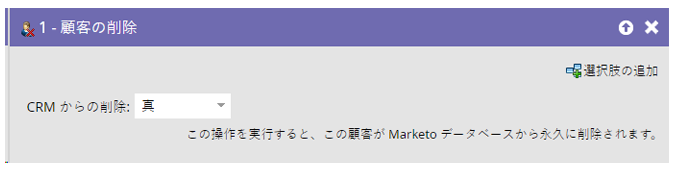
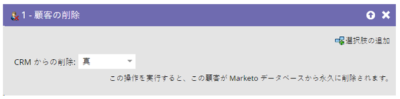
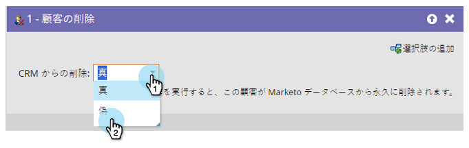

# 人物の削除 {#delete-person}

誤った人物がデータベースに格納されることがあります。 人物を削除フローステップで削除できます。

>[!CAUTION]
>
>人物を削除すると、その人物の履歴 RCE データもすべて削除されます。 これは元に戻せません。

1. フローステップにドラッグすると、CRM からも自動的に削除されるように設定されます。

   

1. 次のように、CRM ではなく Marketo Engage から削除できます。

   

>[!NOTE]
>
>CRM からの人物の削除は、_[!DNL Salesforce]_ でのみ機能します。 人物を Marketo から削除し、[!DNL Salesforce] で保持することにした場合、[!DNL Salesforce] のレコードが更新された場合は、Marketo で再作成されます。
