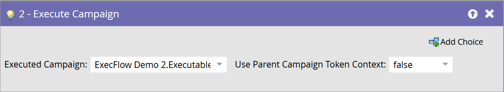

# キャンペーンの実行 {#execute-campaign}

実行可能なキャンペーンには、他のキャンペーンと同様に、スマートリスト、フロー、スケジュールが含まれます。 他のキャンペーンとは異なり、実際にスケジュールを設定したりアクティブ化したりすることはありません。 別のキャンペーンから呼び出す場合は、キャンペーンの実行フローステップを使用する必要があります。 実行可能なキャンペーンのフローステップは、親キャンペーンと直列的に実行されます(別のトリガーキャンペーンで並行して実行されるリクエストキャンペーンとは異なります)。

>[!NOTE]
>
>実行可能なキャンペーンは、常に、呼び出す（親）キャンペーンの子です。

## キャンペーンの実行を使用するタイミング {#when-to-use-execute-campaign}

実行可能なキャンペーンでは、様々な操作を実行できます。 リードルーティング、ライフサイクル管理、スコアリングなど、一般的な運用タスクを容易にするように設計されており、バッチ内またはトリガーされたキャンペーン内から同じワークフローを実行できます。

また、別のフローを実行する必要がある場合にも使用できますが、後続のフローステップの選択でそのフローの結果に依存する必要があります（つまり、その場合は、その結果を実行します）。

キャンペーンの実行は、[キャンペーンをリクエスト](/help/marketo/product-docs/core-marketo-concepts/smart-campaigns/flow-actions/request-campaign.md)の際に改善されます。これは、インシリーズまたは並行で実行できるのに対して、後者は並行して実行するだけです。

>[!NOTE]
>
>待機ステップとWebフックは、実行可能なキャンペーンとは互換性がありません。 その場合は、代わりにリクエストキャンペーンを使用する必要があります。

## 実行可能なキャンペーンの作成方法 {#how-to-create-an-executable-campaign}

1. 目的のプログラムを右クリックし、「**新しいスマートキャンペーン**」を選択します。

   

1. 名前を指定し、「**実行可能ファイル**」チェックボックスを選択して、「**作成**」をクリックします。

   

1. 他のスマートキャンペーンと同様に、スマートリストとフローを定義します。

また、既存のスマートキャンペーンのクローンを作成することもできます。 既存の実行可能なキャンペーンを複製する場合、名前を付けた後で、「**実行可能ファイル**」チェックボックスをオンにする必要があります。

>[!NOTE]
>
>トリガーを含むキャンペーンのクローンはできません。

## 親キャンペーントークンコンテキストを使用 {#use-parent-campaign-token-context}

trueに設定した場合、次のトークンのコンテキストが子キャンペーンに送信されます（実行されるもの）。

* マイ トークン
* キャンペーントークン
* プログラムトークン
* メンバートークン
* [トリガートークン](/help/marketo/product-docs/marketo-sales-insight/msi-for-salesforce/features/tabs-in-the-msi-panel/interesting-moments/trigger-tokens-for-interesting-moments.md) （トリガーされたキャンペーンから呼び出された場合）

**APIインタラクション**

API](https://developers.marketo.com/rest-api/assets/smart-campaigns/#batch)でスケジュールまたはリクエストキャンペーン[を使用する場合、両方を使用してマイトークンの値を渡すことができます。この値は、呼び出し元のキャンペーンで設定された値を上書きします。 その後、そのキャンペーンで別のキャンペーンを実行し、「親コンテキストを使用」を「True」に設定した場合、アプリケーションで設定された値ではなく、APIを介して渡された値が使用されます。

## 注意事項 {#things-to-note}

* スマートリストは、資格を持たないユーザーを除外します。 該当する場合、結果の実行済みキャンペーンアクティビティレコードには、「認定済み」と表示されます。TRUE」（そうでない場合はFALSE）
* キャンペーン認定ルールのスケジュールを適用します（「スケジュール」タブの「スマートキャンペーン設定」）
* 実行可能なキャンペーンは、ワークスペース全体で呼び出すことはできません
* 実行可能なキャンペーンを対象として[フローから削除](/help/marketo/product-docs/core-marketo-concepts/smart-campaigns/flow-actions/remove-from-flow.md)フローアクションを使用すると、子と親の両方をターゲットにします
* トークンの継承の活用 — 例えば、複数の異なるアセットでトリガーされる単一の共通スコアフローがある場合、親キャンペーンの子スコアキャンペーン値を上書きできるよう、子キャンペーンと親キャンペーンでデフォルトのマイトークンスコアを定義できます（以下はビジュアルの例を参照）
* 実行可能なキャンペーンは、最大3レベルまで呼び出すことができます（例：親キャンペーン/子/子）。

>[!CAUTION]
>
>実行可能なキャンペーン用のスマートリストを無効のままにしないでください。そうしないと、**誰も**&#x200B;に該当しません。 個別のスマートリストアセットを作成し、完全に定義して、それらが有効であることを確認することをお勧めします。 次に、実行可能なキャンペーンで「スマートリストのメンバー」フィルターを使用して、スマートリスト定義を入れ替えることができます。

## トークンの継承の例 {#token-inheritance-example}

以下に、1つの実行可能なキャンペーンと2つの親キャンペーンでのトークンの継承の視覚的な例を示します。1つはトークンコンテキストが&#x200B;**True**&#x200B;に設定され、もう1つは&#x200B;**False**&#x200B;に設定されます。

トークン化された変更スコアを持つ子キャンペーン。

子キャンペーンのマイトークン。

**例1 - True**

最初の親キャンペーンのキャンペーンフローの実行手順で、「親キャンペーントークンのコンテキストを使用」が&#x200B;**True**&#x200B;に設定されます。

親キャンペーンのマイトークン。

結果は次のとおりです。スコアが+10で変更されました。

**例2:False**

2つ目の親キャンペーンの「キャンペーンを実行」フィルターで、「親キャンペーントークンのコンテキストを使用」が&#x200B;**False**&#x200B;に設定されます。

親キャンペーンのマイトークン。

結果は次のとおりです。子キャンペーンのスコア値+0が使用されたので、スコアは変更されません。

