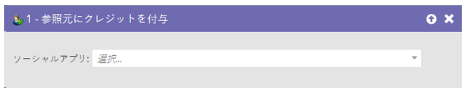
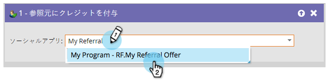

# リファラーへのクレジット付与 {#give-credit-to-referrer}

_オファー紹介_&#x200B;または&#x200B;_懸賞_&#x200B;を運用すると、様々な方法で参照元にクレジットを付与することができます。

* 参照による訪問
* 参照によるサインアップ
* **スマートリストトリガー**
* カスタム Javascript イベント

「**スマートリストトリガー**」オプションを選択して目標を指定する場合には、**[!UICONTROL 参照元にクレジットを付与]**&#x200B;フローステップを使用する必要があります。

1. キャンペーンを作成し、どんなアクションでトリガーするかを決定したら、参照元にクレジットを付与したいソーシャルアプリを検索して選択します。

   

   >[!NOTE]
   >
   >ソーシャルアプリは、スマートリストトリガーを使用するように設定されている必要があります。詳しくは、_紹介オファーの目標の指定_&#x200B;を参照してください。

これで完了です。このフローステップによって所有されているリードから、参照元にクレジットを付与されるようになります。
