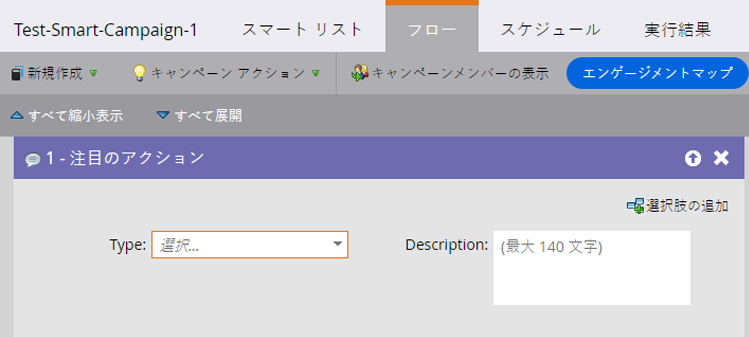
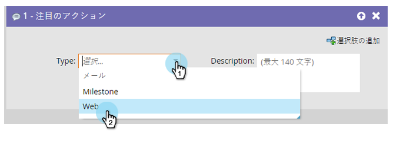
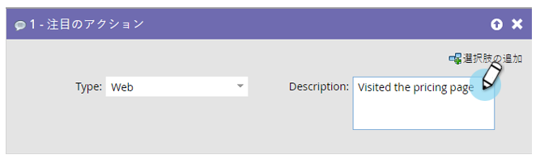

# 注目のアクション {#interesting-moment}

Marketo Sales Insight を使用している場合、**注目のアクション**&#x200B;フローステップを使用して、人物が行っている注目すべきことをセールスチームが把握できるようにすることができます。

1. 使用する注目のアクション&#x200B;**[!UICONTROL タイプ]**&#x200B;を選択します。

   

1. 注目のアクションについてセールスチームに伝える&#x200B;**[!UICONTROL 説明]**&#x200B;を作成します。

   

   >[!TIP]
   >
   >_少ないほうが効果的です_。セールスチームと協力して、注目のアクションが実際に注目するべきものであることを確認します。

また、[注目のアクショにトークン](/help/marketo/product-docs/marketo-sales-insight/msi-for-salesforce/features/tabs-in-the-msi-panel/interesting-moments/trigger-tokens-for-interesting-moments.md){target="_blank"}を使用して動的な説明を作成すると、大いに役立ちます。

>[!MORELIKETHIS]
>
>* [注目のアクションの使用](/help/marketo/product-docs/marketo-sales-insight/msi-for-salesforce/features/tabs-in-the-msi-panel/interesting-moments/using-interesting-moments.md){target="_blank"}
>* [注目のアクションのトークン](/help/marketo/product-docs/marketo-sales-insight/msi-for-salesforce/features/tabs-in-the-msi-panel/interesting-moments/trigger-tokens-for-interesting-moments.md){target="_blank"}
