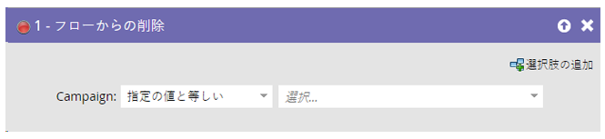
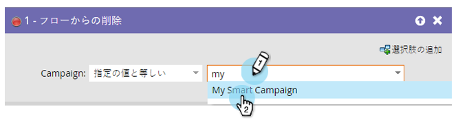

# フローから削除 {#remove-from-flow}

「アラートの送信」を使用して、有望な見込み客に電話するようにセールス担当に促すスマートなキャンペーンフローがあるとします。担当者が電話するまで、毎日 1 つのメッセージを送信します。見込み客に連絡があったら、トリガーキャンペーンで「フローから削除」を使用して、今後のアラートを停止できます。これは、スマートキャンペーンの射出座席のようなものです。

>[!NOTE]
>
>これは通常、キャンペーンフローの待機ステップにいる人物に影響します。

1. 人物を削除するスマートキャンペーンを見つけて選択します。

   

>[!NOTE]
>
>特定のスマートキャンペーンを選択するか、「**[!UICONTROL キャンペーン]**」ドロップダウンで「このキャンペーン」を選択して、その時点で物理的に存在しているキャンペーンを選択できます。

>[!NOTE]
>
>この機能は、スマートキャンペーンのフローステップ内で使用することを意図したものです。
